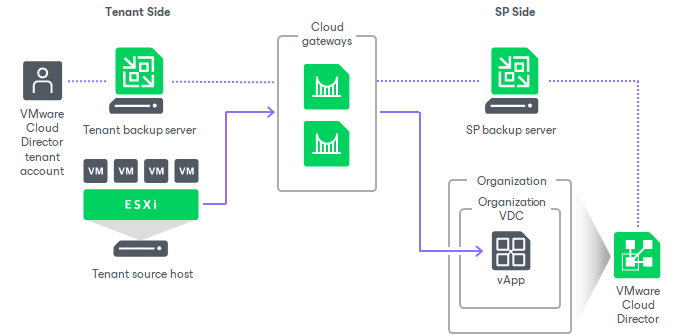

In this article

To let the tenant create VM replicas in VMware Cloud Director, the SP must register for this tenant a tenant account of a specific type — a VMware Cloud Director tenant account. When the SP registers a VMware Cloud Director tenant account, the SP permits the tenant to access Cloud Director organization resources from Veeam Backup & Replication. To provide replication resources to an account of this type, in the properties of the account, the SP selects an organization and its organization VDCs that will be available to the tenant as cloud hosts. This contrasts to the similar scenario for a standalone tenant account where replication resources are provided to tenants through hardware plans.

The tenant with a registered VMware Cloud Director tenant account has access to organization VDCs allocated to the organization in Cloud Director. The tenant can use these organization VDCs as cloud hosts for VM replicas. Tenants without VMware Cloud Director accounts cannot create VM replicas on cloud hosts that utilize Cloud Director resources of the SP.

One VMware Cloud Director tenant account can use resources of one VMware Cloud Director organization only. The SP can allocate to the tenant one or more organization VDCs of the same organization.

The tenant with a registered VMware Cloud Director tenant account connects to the SP in the Veeam backup console using credentials of the organization user account that has administrative rights in the organization. The SP must create this user account in advance in the properties of the organization in VMware Cloud Director. The account must have the following permissions:

* General: Administrator Control
* General: Administrator View
* Group / User: View

Cloud Repository for VMware Cloud Director Tenant Accounts

As well as replication resources, the SP can allocate backup resources to a VMware Cloud Director tenant account. For accounts of this type, the Veeam Cloud Connect Backup scenario is the same as for standalone tenant accounts. To learn more, see [Veeam Cloud Connect Backup](cloud_backup.md).

Tenants with VMware Cloud Director tenant accounts can create the following types of backups in a cloud repository:

* VM backups.
* Machine backups created by Veeam Agent operating in the standalone mode. To learn more, see [Subtenant Accounts for VMware Cloud Director Tenant Accounts](#vcd_subtenants).

Subtenant Accounts for VMware Cloud Director Tenant Accounts

The SP can allow users on the tenant side to connect to the SP in Veeam Agent for Microsoft Windows or Veeam Agent for Linux and create Veeam Agent backups in a cloud repository. To do this, the SP must create one or more subtenant accounts for the VMware Cloud Director tenant account.

The process of creating a subtenant account for a VMware Cloud Director tenant account is similar to the same process for a standalone tenant account. The only difference is that the SP selects from organization user accounts configured in VMware Cloud Director instead of creating a new account. To create a subtenant account, the SP can use any organization user account that is not granted administrative rights in the organization.

|  |
| --- |
| Note |
| Veeam Backup & Replication does not support creating managed subtenant accounts for a VMware Cloud Director tenant account. Thus, a Cloud Director tenant cannot add Veeam Agent machines to backup policies targeted at the cloud repository. |

Related Tasks

* [Configuring VMware Cloud Director Tenant Account](cloud_vcd_tenant.md)

* [Managing Subtenant Accounts on SP Side](cloud_connect_subtenants_manage.md)
* [Managing Subtenant Accounts on Tenant Side](cloud_connect_subtenants_use.md)

Page updated 1/26/2024

Page content applies to build 13.0.1.1071
