# Creating CDP Policies for VMware vSphere

To create CDP replicas, you must configure a CDP policy. The CDP policy defines which VMs to protect, where to store replicas, how often to create short-term and long-term restore points, and so on. One CDP policy can process one or multiple VMs.

|  |
| --- |
| Note |
| This section describes only basic steps that you must take to create a CDP policy for VMware vSphere targeted at the cloud host. To get a detailed description of all CDP for VMware vSphere policy settings, see the [Creating CDP Policies](https://helpcenter.veeam.com/docs/vbr/userguide/cdp_policy_create.html?ver=13) section in the Veeam Backup & Replication User Guide. |

To create a CDP policy:

1. On the Home tab, click CDP Policy and select VMware vSphere.
2. At the Name step of the wizard, specify a name and description for the CDP policy.
3. If you want to use advanced settings for the CDP policy:

* Select the Replica seeding check box to enable the Seeding step in the wizard.
* Select the Network remapping check box to enable the Network step in the wizard. Veeam Backup & Replication does not currently support automatic connection of a Linux-based VM replica to the network on the cloud host. You must use the Network step of the wizard to manually select source and target networks for such replicas.
* Veeam Backup & Replication does not support re-IP rules for VM replicas on the cloud host. Do not select the Replica re-IP check box for the CDP policy targeted at the cloud host. If you select the Replica re-IP option, this option will be disabled when you select the cloud host at the Destination step of the wizard.

1. At the Virtual Machines step of the wizard, click Add and select VMs and VM containers that you want to replicate. To quickly find the necessary object, use the search field at the bottom of the Add Objects window.

|  |
| --- |
| Important |
| Consider the following:   * You can replicate only VMs that are turned on, the turned off VMs will be skipped from processing. * You cannot add to a CDP policy VMs that were already added to other CDP policies created on the same backup server. |

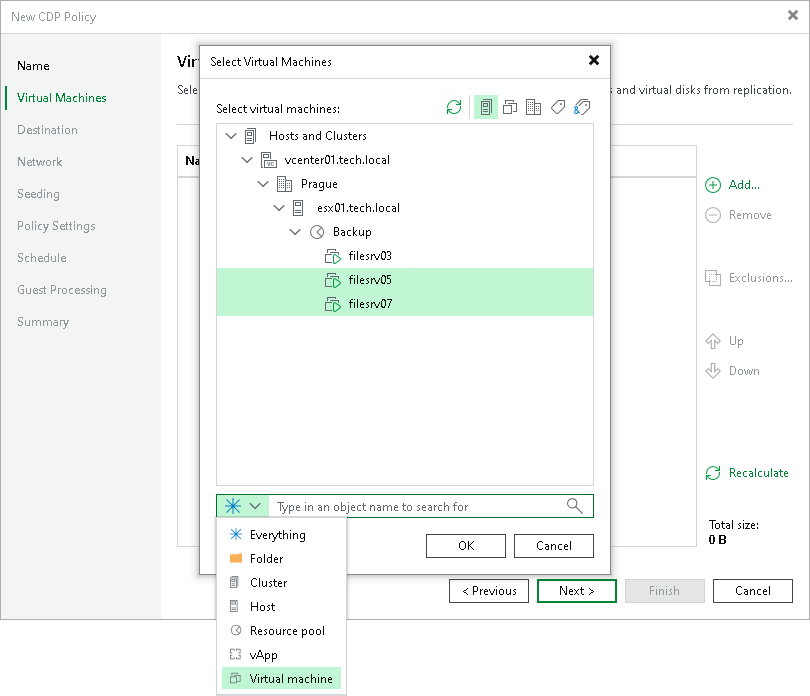

1. If you want to exclude VMs from the VM container or replicate only specific VM disks, click Exclusions and specify what objects you want to exclude.
2. If you want to define the order in which the CDP policy must process VMs, select a VM or VM container added to the policy and use the Up and Down buttons on the right to move the VM or VM container up or down in the list.
3. At the Destination step of the wizard, in the Host or cluster section, click Choose and select Cloud host. Then select the cloud host allocated to you by the SP:

* If the SP allocated to you replication resources on a VMware vSphere host, select the cloud host provided to you through a hardware plan.

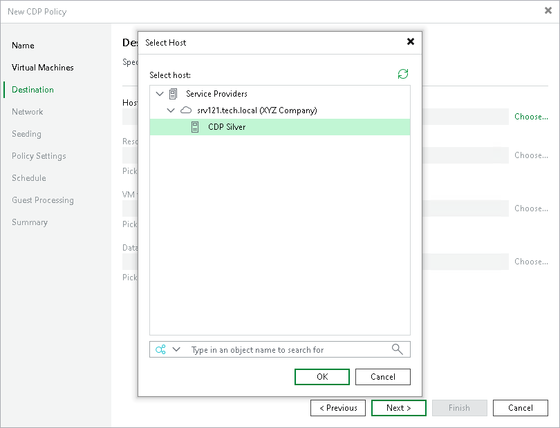

* If the SP allocated to you replication resources in VMware Cloud Director, select the cloud host provided to you through an organization VDC.

|  |
| --- |
| Note |
| After you select an organization VDC, the name of the Host or cluster section will change to Organization VDC. |

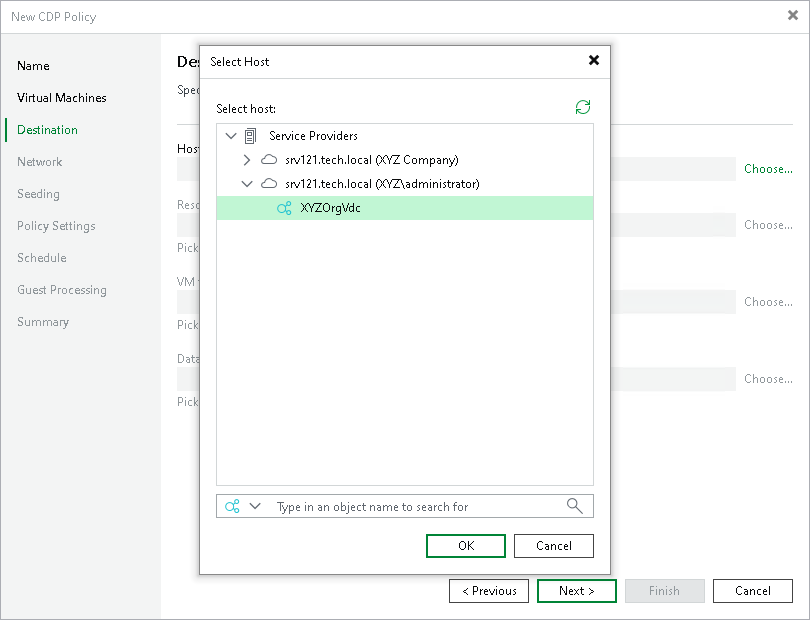

Note that after the CDP policy is performed for the first time, you will not be able to change the target host for the CDP policy.

1. At the Destination step of the wizard, select storage resources allocated to you by the SP:

* [For a CDP policy targeted at VMware vSphere] If you want to specify a datastore on which to store VM replicas, in the Datastore section, click Choose and select the necessary datastore.

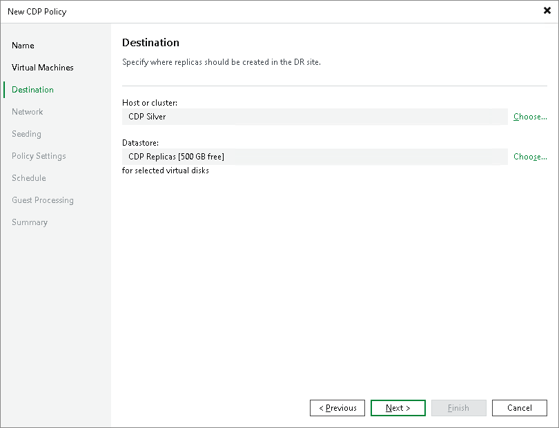

* [For a CDP policy targeted at VMware Cloud Director] If you want to specify a vApp or storage policy for VM replicas, do the following:

1. In the vApp section, click Choose and select the necessary vApp.

Note that you must not use the same vApp as a target for both a CDP policy and a snapshot-based replication job.

1. In the Storage policy section, click Choose and select the necessary storage policy.

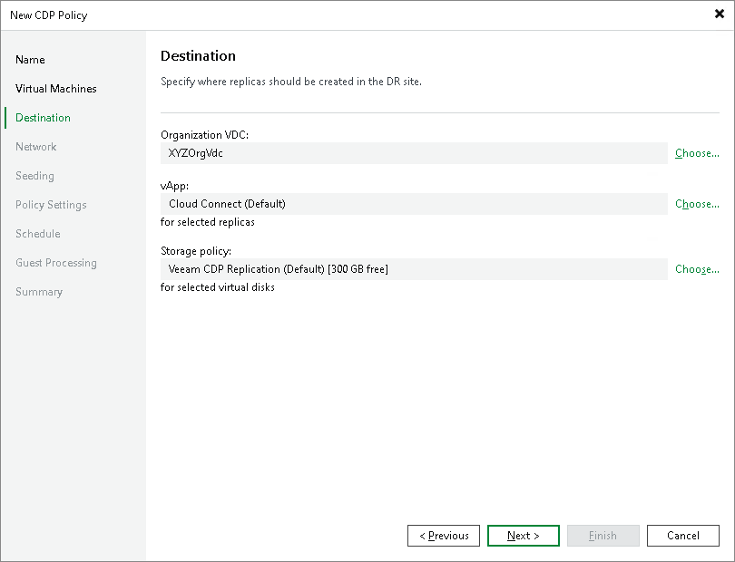

1. At the Network step of the wizard, in the Network mapping section, click Add and select the production network to which VMs added to the CDP policy are connected and network on the cloud host to which VM replicas must be connected.

You must specify network mapping settings in the following cases:

* If you added Microsoft Windows VMs to the CDP policy and do not plan to enable application-aware processing for these VMs at the Guest Processing step of the wizard.
* If you added Linux VMs to the CDP policy. Automatic network mapping for non-Windows VMs is not currently supported in Veeam Cloud Connect Replication.
* If the cloud host has fewer networks than the number of networks in the production infrastructure.

It is also recommended to specify network mapping settings if IPv6 communication is enabled in the Veeam Cloud Connect infrastructure.

To learn more, see [Network Mapping for Cloud Replicas](cloud_network_mapping.md).

|  |
| --- |
| Note |
| [For a CDP policy targeted at VMware Cloud Director] You cannot map a production network to an isolated vApp network in VMware Cloud Director. |

|  |
| --- |
| Tip |
| Because Veeam Cloud Connect Replication does not support automatic network mapping for non-Windows VMs, during the CDP policy performance, in the list of operations for such VMs in the CDP policy, Veeam Backup & Replication will display a warning that no static IP addresses are detected for the VM. If in fact the VM has a static IP address and network mapping settings are specified for the VM, this warning can be ignored.  You can instruct Veeam Backup & Replication to suppress the warning. To remove the warning from the CDP policy session statistics, on the tenant Veeam backup server, create the registry value HKEY\_LOCAL\_MACHINE\SOFTWARE\Veeam\Veeam Backup and Replication\CloudReplicaNoStaticIpSDetectedWarning = 0 (DWORD) and restart Veeam Backup Service. |

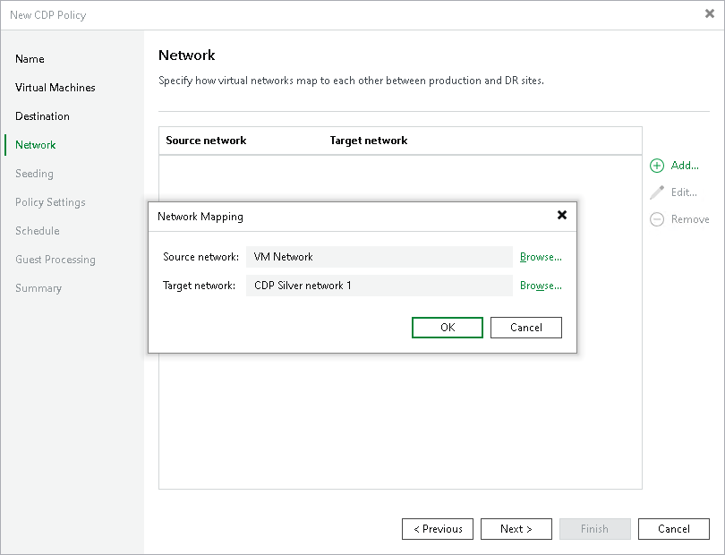

1. At the Seeding step of the wizard, configure replica seeding and mapping for the CDP policy.

* In the Initial seeding section, select the Get seed from the following backup repository check box. From the list of backup repositories, select the regular backup repository or cloud repository where the seed (the full backup) resides. When you start the CDP policy, Veeam Backup & Replication will attempt to restore all VMs added to the CDP policy from the seed that you have specified. If a VM is not found in the seed, the VM will be skipped from replication.
* In the Replica mapping section, select the Map replicas to existing VMs check box, select a production VM from the list, click Edit and choose an existing VM replica. Replica mapping will reduce the amount of VM data transferred over the network during the first session of the CDP policy.

Keep in mind that only CDP replicas can be used for replica mapping.

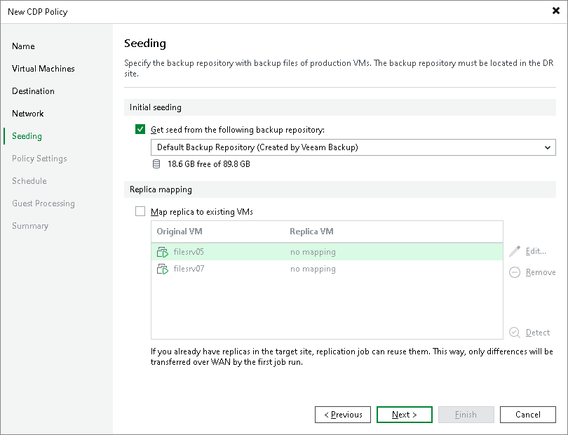

1. At the Policy Settings step of the wizard, click Choose next to the Source proxy field to select a source CDP proxy for the CDP policy. You can choose automatic proxy selection or assign the source proxy explicitly.

You cannot specify a target proxy for the CDP policy targeted at the cloud host. During the CDP policy run, Veeam Backup & Replication will automatically select the target CDP proxy configured by the SP in the SP backup infrastructure.

1. To test whether CDP proxies available in the source backup infrastructure can handle replication, click Verify whether currently available resource can handle CDP activity.

Veeam Backup & Replication will analyze available CPU on all source CDP proxies, the maximum disk write speed during the last hour, and will calculate approximate requirements for CDP proxies. In the CDP Infrastructure Assessment window, you will see the calculated values:

* The Proxy CPU rows show CPU cores available on all source proxies.
* The Proxy RAM rows show RAM required for CDP and, in parenthesis, RAM available on all source proxies. If values in the parentheses and near the paranthesis are the same, you need to upgrade proxies for which values coincide to provide more resources. For example, you can double up the amount of RAM.
* The Proxy Bandwidth rows show the maximum disk write speed during the last hour and, in parenthesis, available bandwidth based on available cores of source or target proxies.

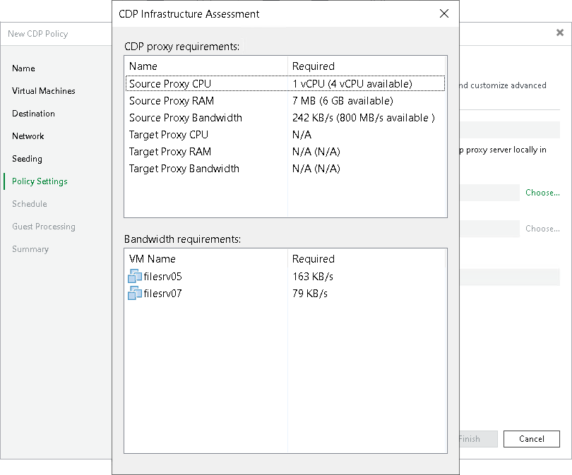

1. In the Replica name suffix field, enter a suffix for the name of VM replicas. To register a VM replica on the target host in the SP site, Veeam Backup & Replication appends the specified suffix to the name of the source VMs.

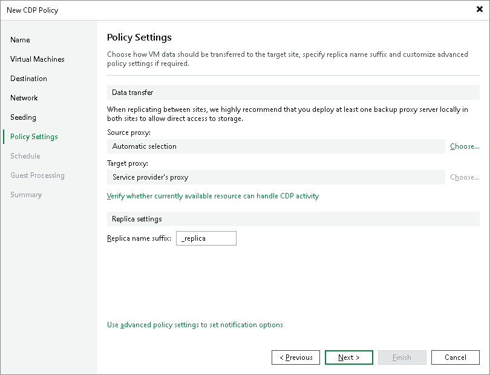

1. At the Schedule step of the wizard, configure schedule and retention policy settings for the CDP policy:

1. In the Recovery Point Objective field, specify the necessary RPO in seconds or minutes, that is, how often to create short-term restore points. The minimum RPO is 2 seconds, however it can be not optimal if your CDP policy contains many VMs with high workload. The optimal RPO is not less than 15 seconds. The maximum RPO is 60 minutes.

During every specified period, Veeam Backup & Replication will prepare data for short-term restore points for VM replicas and send this data to the target destination. Note that short-term restore points are crash-consistent.

1. To instruct the CDP policy to display a warning or error if a newly created restore points are not transferred to the target within the set RPO, click RPO Reporting. Then specify when the policy must display error and warning. If you configured email notification settings, Veeam Backup & Replication will mark the policy with the Warning or Error status and will also send email notifications.
2. In the Short-term retention section, configure the short-term retention policy, that is, specify for how long to store short-term restore points.
3. In the Long-term retention section, specify when to create long-term restore points and for how long to store them.
4. To specify time periods when Veeam Backup & Replication must create application-consistent and crash-consistent long-term restore points, click Schedule, then click Crash-consistent or Application-consistent and select the necessary time area. By default, Veeam Backup & Replication creates application-consistent backups if you enable application-aware processing at the Guest Processing step of the wizard. If you do not enable application-aware processing, Veeam Backup & Replication will create crash-consistent long-term restore points.

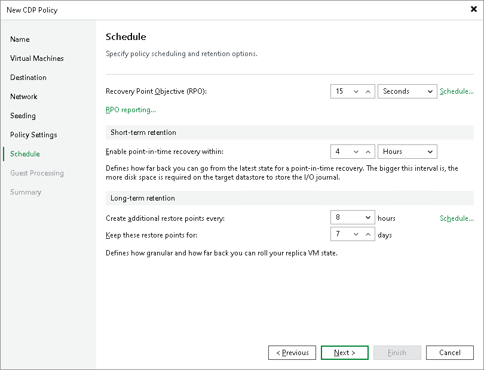

1. At the Guest Processing step of the wizard, select the Enable application-aware processing check box to create transactionally consistent VM replicas. With application-aware processing enabled, Veeam Backup & Replication can detect network settings of replicated VMs in the most efficient way and use the detected settings for configuring network extension appliances. To learn more, see [Network Mapping for Cloud Replicas](cloud_network_mapping.md).

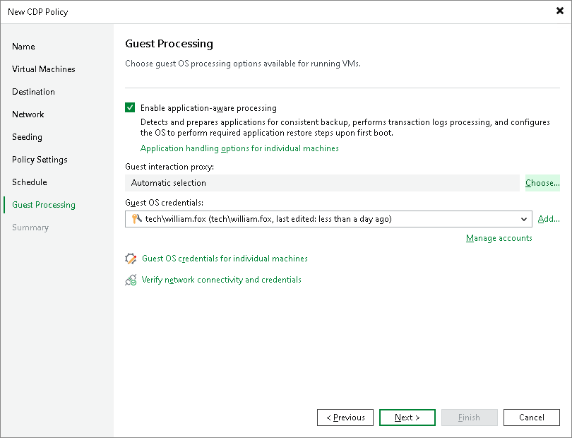

1. Click Add next to the Credentials list and specify credentials for a user account with local administrator privileges on the VM guest OS. By default, Veeam Backup & Replication uses the same credentials for all VMs added to the CDP policy. If some VM requires a different user account, click Credentials and enter custom credentials for the necessary VM.
2. Click Applications, select the necessary VM and click Edit. On the General tab, in the Applications section, specify the VSS behavior scenario:

+ Select Require successful processing if you want Veeam Backup & Replication to stop the backup process if any VSS errors occur.
+ Select Try application processing, but ignore failures if you want to continue the backup process even if VSS errors occur. This option is recommended to guarantee completion of the CDP policy. The created backup image will not be transactionally consistent, but crash consistent.
+ Select Disable application processing if you do not want to enable quiescence for the VM at all.

1. [For Microsoft SQL and Oracle VMs] In the VSS Settings section, specify how Veeam Backup & Replication must handle transaction logs.

+ Select Process transaction logs with this job if you want Veeam Backup & Replication to handle transaction logs. With this option enabled, Veeam Backup & Replication will offer a choice of transaction log processing options on the SQL and Oracle tabs.
+ Select Perform copy only if you use native application means or a third-party tool to process transaction logs. Veeam Backup & Replication will create a copy-only backup for the selected VM. The copy-only backup preserves a chain of full/differential backup files and transaction logs. To learn more, see [Microsoft documentation](https://msdn.microsoft.com/en-us/library/ms191495.aspx).

|  |
| --- |
| Note |
| CDP policies targeted at the cloud host do not support application-aware processing of PostgreSQL VMs. |

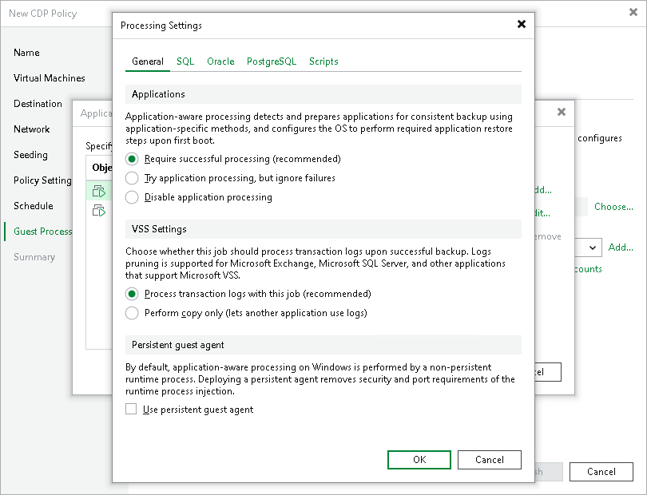

1. At the Summary step of the wizard, select the Enable the policy when I click Finish check box if you want to start the created CDP policy right after you complete working with the wizard.
2. Click Finish.

