# Creating Replication Jobs

In Veeam Backup & Replication, replication is a job-driven process. To create VM replicas, you must configure a replication job. The replication job defines how, where and when to replicate VM data. One job can be used to process one VM or several VMs.

|  |
| --- |
| Note |
| This section describes only basic steps that you must take to create a replication job targeted at the cloud host. To get a detailed description of all replication job settings, see the [Creating Replication Jobs](https://helpcenter.veeam.com/docs/vbr/userguide/replica_job.html?ver=13) section in the Veeam Backup & Replication User Guide. |

To create a replication job:

1. On the Home tab, click Replication Job and select Virtual machine > VMware vSphere or Virtual machine > Microsoft Hyper-V.
2. At the Name step of the wizard, specify a name and description for the replication job.
3. If you want to use advanced settings for the job:

* Select the Replica seeding check box to enable the Seeding step in the wizard.
* Select the Network remapping check box to enable the Network step in the wizard. Veeam Backup & Replication does not currently support automatic connection of a Linux-based VM replica to the network on the cloud host. You must use the Network step of the wizard to manually select source and target networks for such replicas.
* Veeam Backup & Replication does not support re-IP rules for VM replicas on the cloud host. Do not select the Replica re-IP check box for the replication job targeted at the cloud host. If you select the Replica re-IP option, this option will be disabled when you select the cloud host at the Destination step of the wizard.

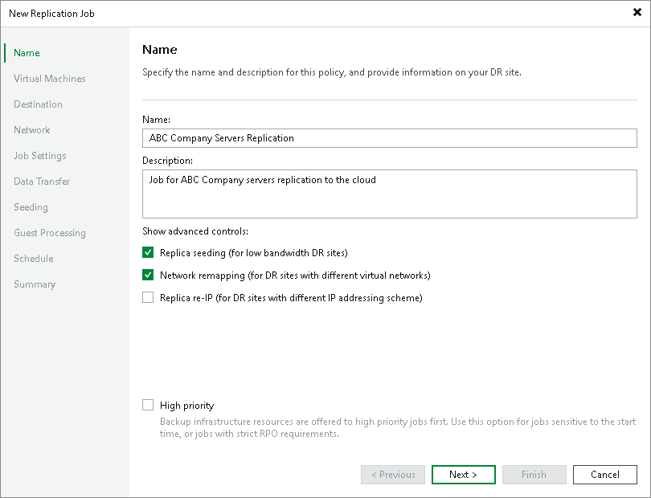

1. At the Virtual Machines step of the wizard, click Add and select VMs and VM containers that you want to replicate. To quickly find the necessary object, use the search field at the bottom of the Add Objects window.

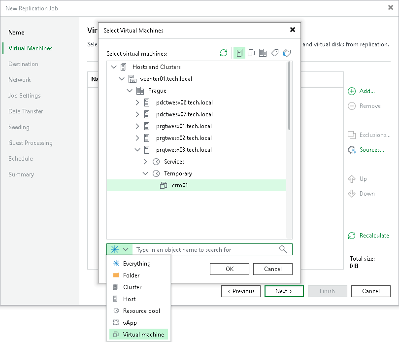

1. If you want to specify the source from which VM data must be read, click Sources and select one of the following options:

* From production storage. In this case, Veeam Backup & Replication will retrieve VM data from the production storage connected to the source virtualization host.

* From backup files. In this case, Veeam Backup & Replication will read VM data from a backup chain already existing in the regular backup repository or cloud repository.

1. If you want to exclude VMs from the VM container or replicate only specific VM disks, click Exclusions and specify what objects you want to exclude.
2. If you want to define the order in which the replication job must process VMs, select a VM or VM container added to the job and use the Up and Down buttons on the right to move the VM or VM container up or down in the list.
3. At the Destination step of the wizard, in the Host or cluster section, click Choose and select Cloud host. Then select the cloud host allocated to you by the SP:

* If the SP allocated to you replication resources on a VMware vSphere or Microsoft Hyper-V host, select the cloud host provided to you through a hardware plan.

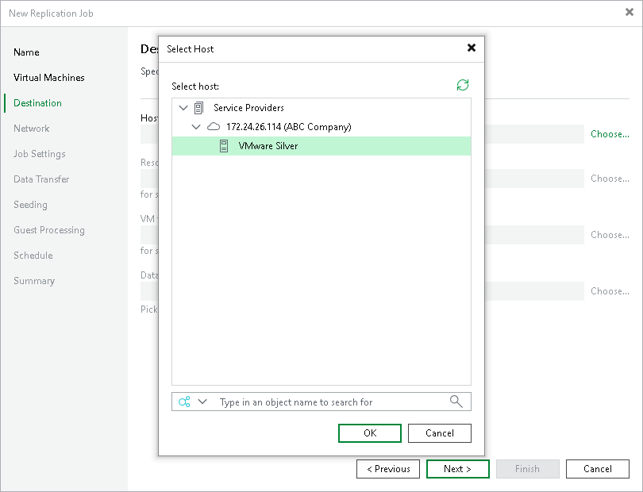

* If the SP allocated to you replication resources in VMware Cloud Director, select the cloud host provided to you through an organization VDC.

|  |
| --- |
| Note |
| After you select an organization VDC, the name of the Host or cluster section will change to Organization VDC. |

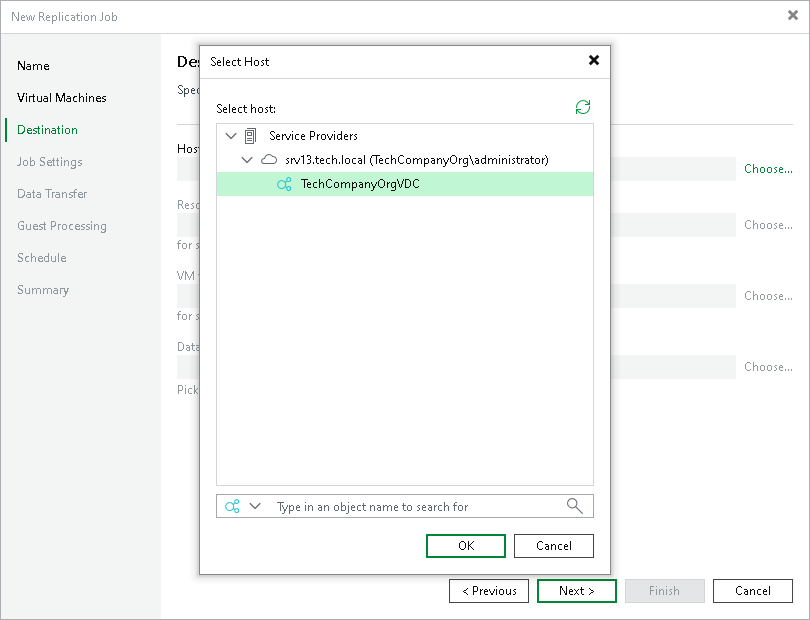

Note that after the replication job is performed for the first time, you will not be able to change the target host for the job.

1. At the Destination step of the wizard, select storage resources allocated to you by the SP:

* [For a VMware replication job] If you want to specify a datastore on which to store VM replicas, in the Datastore section, click Choose and select the necessary datastore.

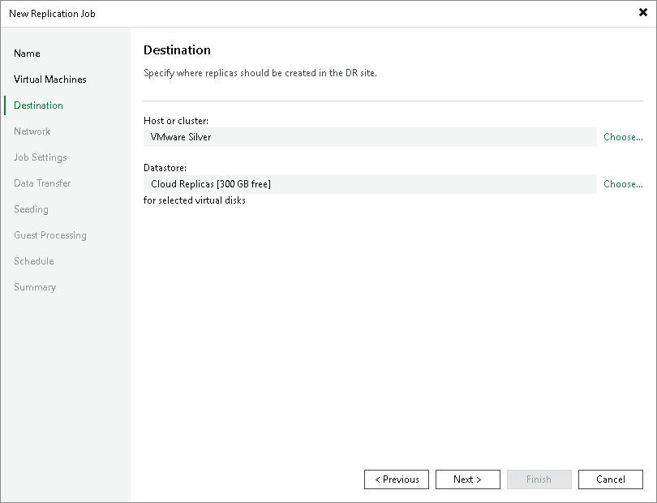

* [For a Hyper-V replication job] If you want to specify a path to the storage on which to store VM replicas, in the Path section, click Choose and select the necessary storage.

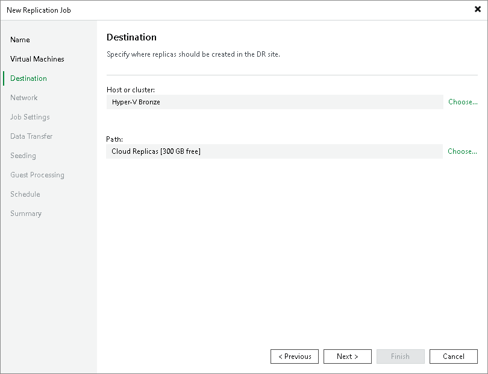

* [For a replication job targeted at VMware Cloud Director] If you want to specify a vApp or storage policy for VM replicas, do the following:

1. In the vApp section, click Choose and select the necessary vApp.

Note that you must not use the same vApp as a target for both a snapshot-based replication job and a CDP policy.

1. In the Storage policy section, click Choose and select the necessary storage policy.

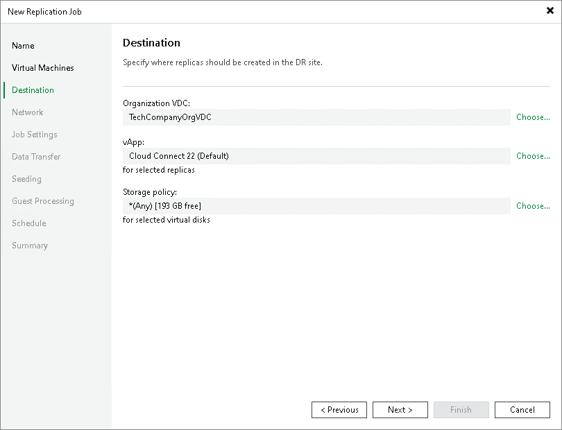

1. At the Network step of the wizard, in the Network mapping section, click Add and select the production network to which VMs in the job are connected and network on the cloud host to which VM replicas must be connected. Repeat this step for every network to which Linux VM replicas must be connected — automatic network mapping for non-Windows VMs is not currently supported in Veeam Cloud Connect Replication.

Specifying network mapping settings may be also required, for example, if the cloud host has fewer networks than the number of networks in the production infrastructure. To learn more, see [Network Mapping for Cloud Replicas](cloud_network_mapping.md).

|  |
| --- |
| Tip |
| Because Veeam Cloud Connect Replication does not support automatic network mapping for non-Windows VMs, during the job performance, in the list of operations for such VMs included in the job, Veeam Backup & Replication will display a warning that no static IP addresses are detected for the VM. If in fact the VM has a static IP address and network mapping settings are specified for the VM, this warning can be ignored.  You can instruct Veeam Backup & Replication to suppress the warning. To remove the warning from the job session statistics, on the tenant Veeam backup server, create the registry value HKEY\_LOCAL\_MACHINE\SOFTWARE\Veeam\Veeam Backup and Replication\CloudReplicaNoStaticIpSDetectedWarning = 0 (DWORD) and restart Veeam Backup Service. |

|  |
| --- |
| Note |
| [For a replication job targeted at VMware Cloud Director] You cannot map a production network to an isolated vApp network in VMware Cloud Director. |

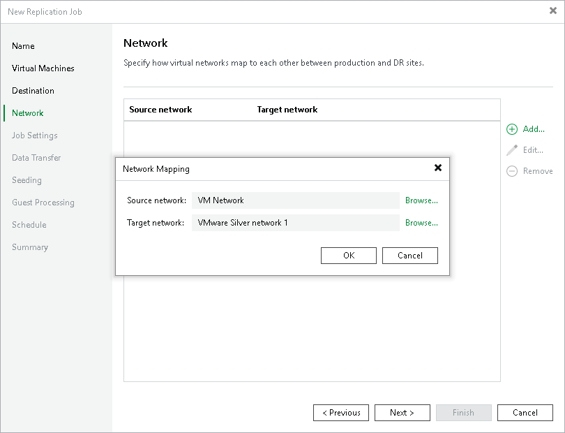

1. At the Job Settings step of the wizard, from the Repository for replica metadata list, select a regular backup repository that is configured in your backup infrastructure. Veeam Backup & Replication will store in the selected backup repository metadata for VM replicas — checksums of read data blocks required to streamline incremental runs of the replication job.

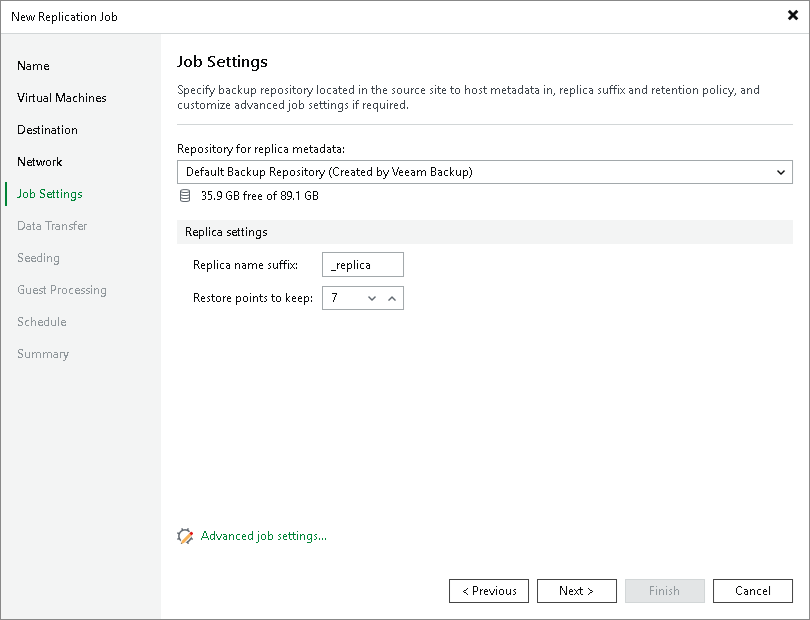

1. In the Replica name suffix field, enter a suffix for the name of VM replicas. To register a VM replica on the target host in the SP site, Veeam Backup & Replication appends the specified suffix to the name of the source VMs.
2. In the Restore points to keep field, specify the number of restore points that should be maintained by the replication job. If this number is exceeded, the earliest restore point will be deleted.
3. At the Data Transfer step of the wizard, select backup infrastructure components that must be used for the replication process and choose a path for VM data transfer:

* Click Choose next to the Source proxy field to select a source backup proxy for the job. You can choose automatic backup proxy selection or assign the source backup proxy explicitly.

You cannot specify a target backup proxy for the replication job targeted at the cloud host. During the replication job run, Veeam Backup & Replication will automatically select the target backup proxy configured by the SP in the SP Veeam Backup & Replication infrastructure.

* To transport VM data directly through one or more backup proxies to the cloud host, select Direct.
* To transport VM data through WAN accelerators, select Through built-in WAN accelerators. In the Source WAN accelerator field, select the WAN accelerator that you have configured on your side.

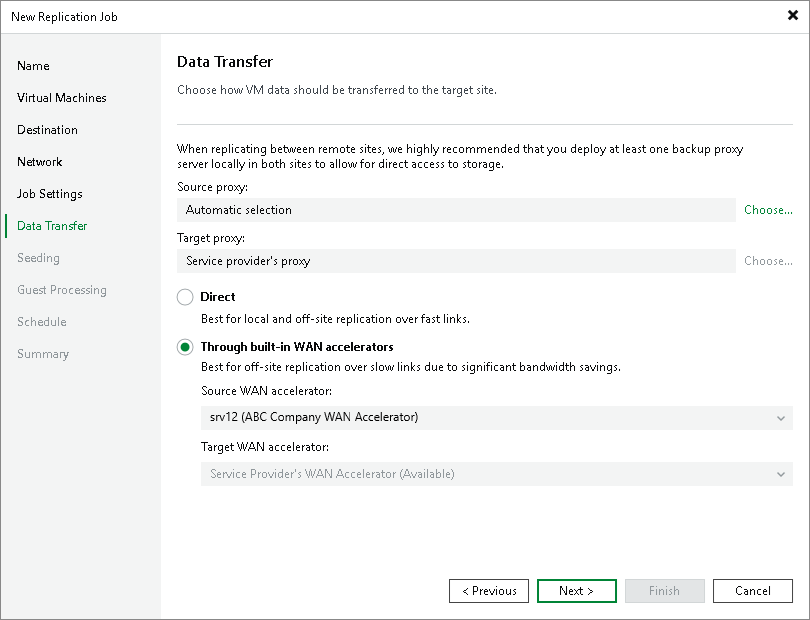

1. At the Seeding step of the wizard, configure replica seeding and mapping for the replication job.

* In the Initial seeding section, select the Get seed from the following backup repository check box. From the list of backup repositories, select the regular backup repository or cloud repository where the seed (the full backup) resides. When you start the replication job, Veeam Backup & Replication will attempt to restore all VMs added to the job from the seed that you have specified. If a VM is not found in the seed, the VM will be skipped from replication.
* In the Replica mapping section, select the Map replicas to existing VMs check box, select a production VM from the list, click Edit and choose an existing VM replica. Replica mapping will reduce the amount of VM data transferred over the network during the first session of the replication job.

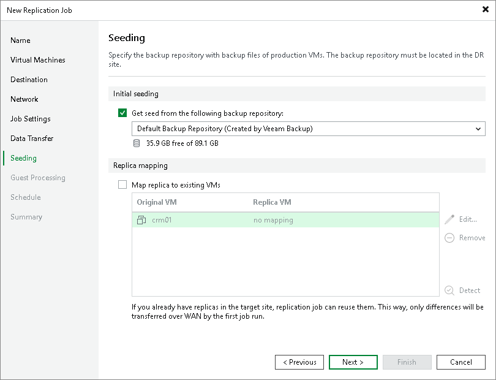

1. At the Guest Processing step of the wizard, select the Enable application-aware processing check box to create transactionally consistent VM replicas. With application-aware processing enabled, Veeam Backup & Replication can detect network settings of replicated VMs in the most efficient way and use the detected settings for configuring network extension appliances. To learn more, see [Network Mapping for Cloud Replicas](cloud_network_mapping.md).

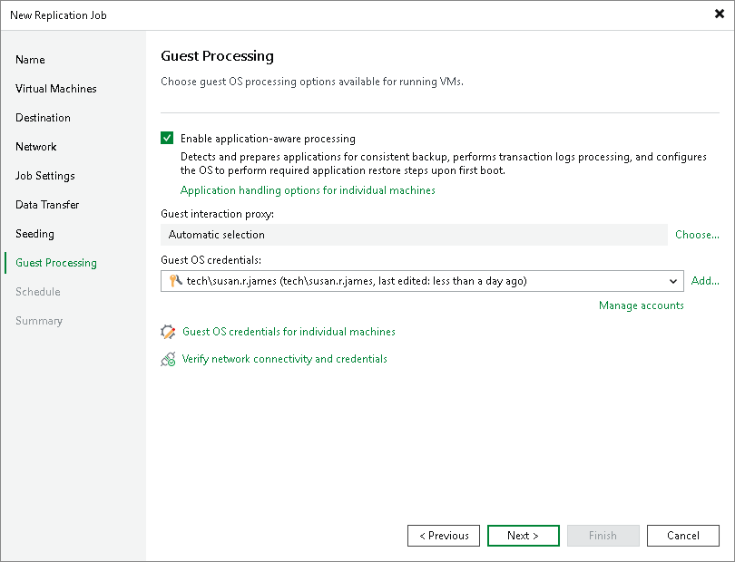

1. Click Add next to the Credentials list and specify credentials for a user account with local administrator privileges on the VM guest OS. By default, Veeam Backup & Replication uses the same credentials for all VMs added to the job. If some VM requires a different user account, click Guest OS credentials for individual machines and enter custom credentials for the necessary VM.
2. Click Application handling options for individual machines, select the necessary VM and click Edit. On the General tab, in the Applications section, specify the VSS behavior scenario:

* Select Require successful processing if you want Veeam Backup & Replication to stop the backup process if any VSS errors occur.

* Select Try application processing, but ignore failures if you want to continue the backup process even if VSS errors occur. This option is recommended to guarantee completion of the job. The created backup image will not be transactionally consistent, but crash consistent.

* Select Disable application processing if you do not want to enable quiescence for the VM at all.

1. [For Microsoft SQL, Oracle and PostgreSQL VMs] In the VSS Settings section, specify how Veeam Backup & Replication must handle transaction logs.

* Select Process transaction logs with this job if you want Veeam Backup & Replication to handle transaction logs. If you enable this option, for Microsoft SQL and Oracle VMs Veeam Backup & Replication will offer a choice of transaction log processing options on the SQL and Oracle tabs.

* Select Perform copy only if you use native application means or a third-party tool to process transaction logs. Veeam Backup & Replication will create a copy-only backup for the selected VM. The copy-only backup preserves a chain of full/differential backup files and transaction logs. To learn more, see [Microsoft documentation](https://msdn.microsoft.com/en-us/library/ms191495.aspx).

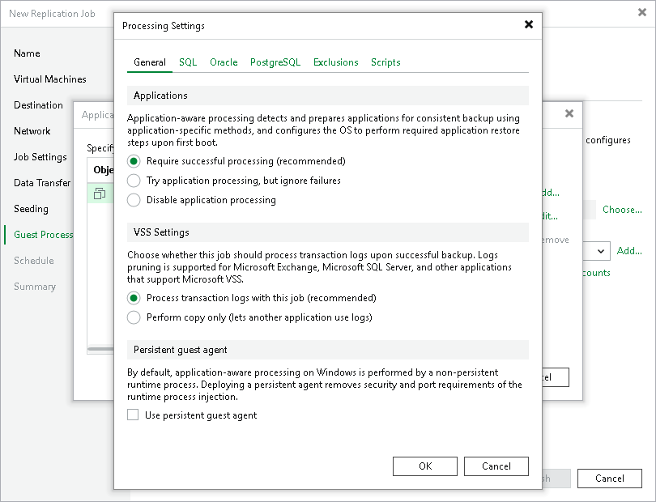

1. At the Schedule step of the wizard, select the Run the job automatically check box and specify the necessary scheduling settings for the job. If you do not select this check box, you will have to run the replication job manually to create restore points for VM replicas in the cloud.

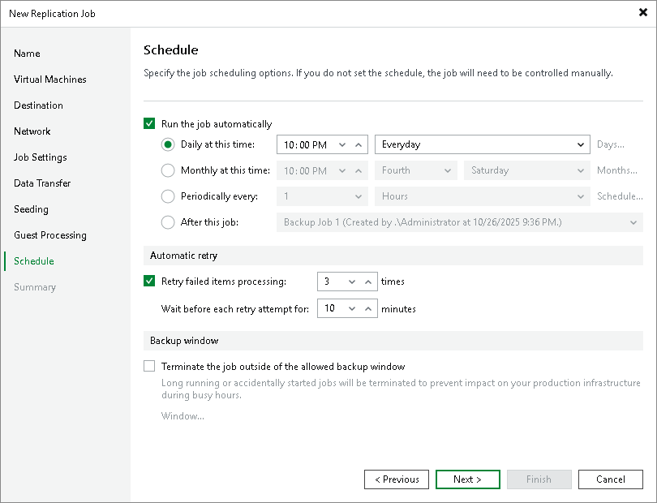

1. At the Summary step of the wizard, select the Run the job when I click Finish check box if you want to start the created job right after you complete working with the wizard.
2. Click Finish.

