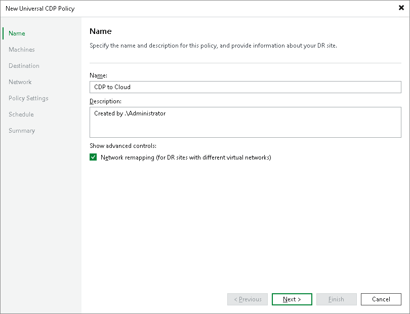
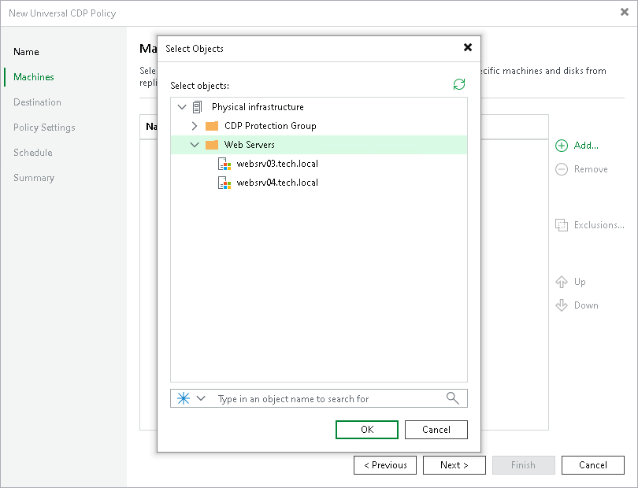
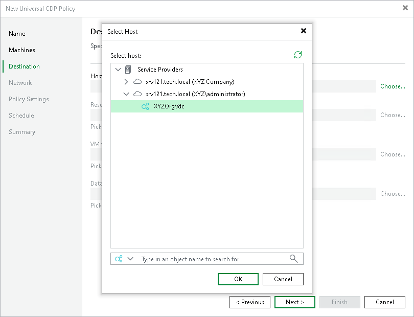
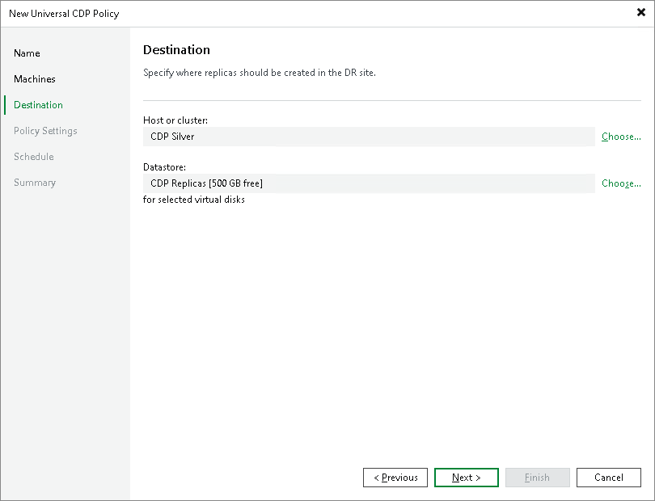
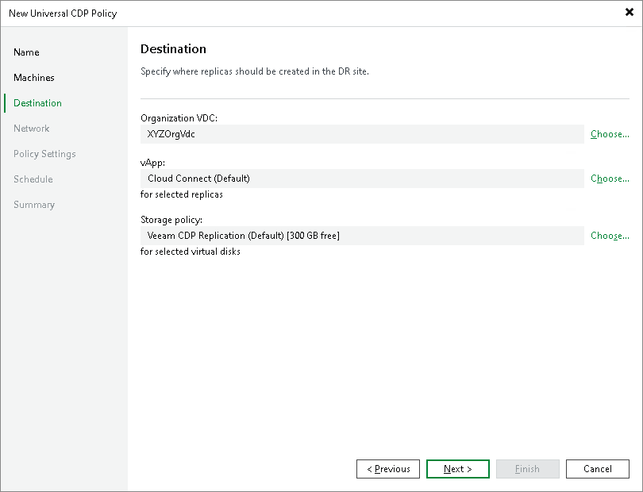
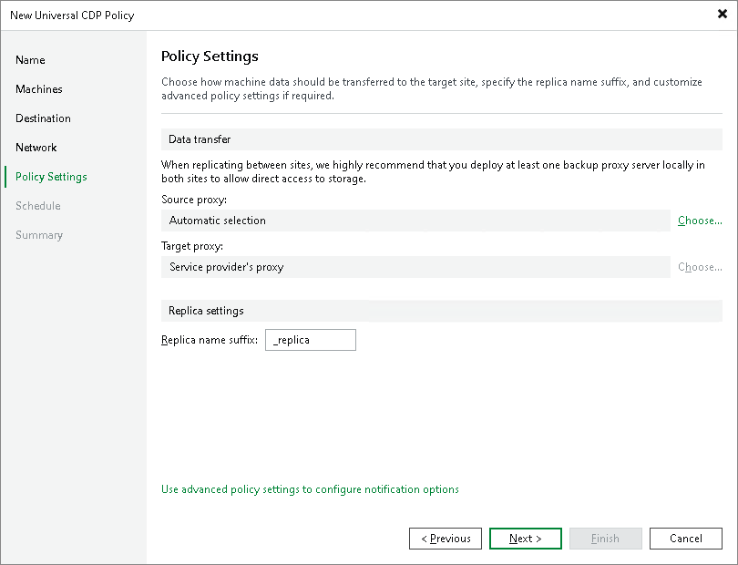
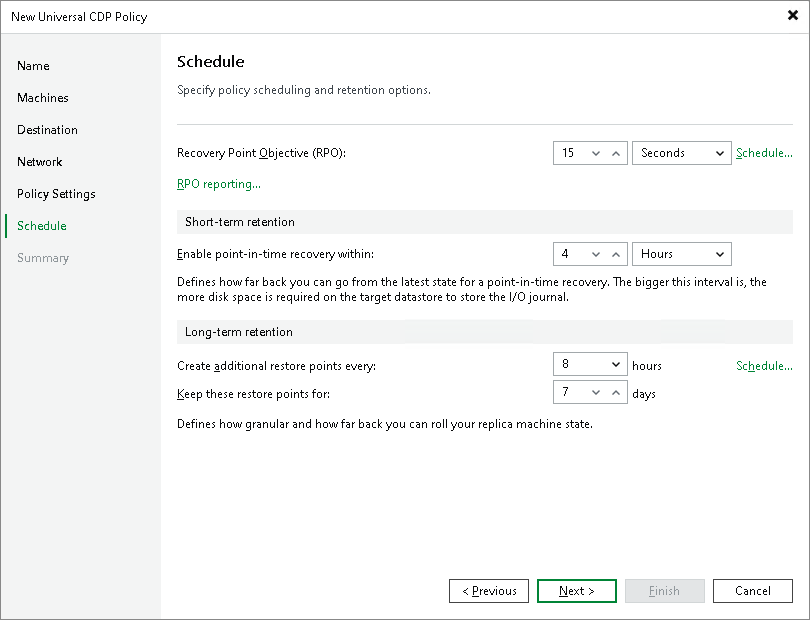

In this article

To protect workloads with universal CDP, you must configure a CDP policy. The CDP policy defines which workloads to protect, where to store replicas, how often create short-term and long-term restore points, and so on. One CDP policy can process one or multiple workloads.

|  |
| --- |
| Note |
| This section describes only basic steps that you must take to create a universal CDP policy targeted at the cloud host. To get a detailed description of all universal CDP policy settings, see the [Creating Universal CDP Policies](https://helpcenter.veeam.com/docs/vbr/userguide/uni_cdp_policy_create.html?ver=13) section in the Veeam Backup & Replication User Guide. |

To create a universal CDP policy:

1. On the Home tab, click CDP Policy and select Universal CDP.
2. At the Name step of the wizard, specify a name and description for the CDP policy.
3. If you want to use advanced settings for the CDP policy, select the Network remapping check box to enable the Network step in the wizard.

1. At the Machines step of the wizard, click Add and select workloads or protection groups that contain workloads you want to replicate. To quickly find the necessary object, use the search field at the bottom of the Select Objects window.

|  |
| --- |
| Important |
| Consider the following:   * You can replicate only workloads that are turned on, the turned off workloads will be skipped from processing.  * You cannot add to a universal CDP policy workloads that were already added to other universal CDP policies created on the same backup server. |

1. If you want to exclude workloads from the CDP policy, click Exclusions and specify what objects you want to exclude.
2. If you want to define the order in which the CDP policy must process workloads or protection groups, select a workload or protection group added to the policy and use the Up and Down buttons on the right to move the object up or down in the list.
3. At the Destination step of the wizard, in the Host or cluster section, click Choose and select Cloud host. Then select the cloud host allocated to you by the SP:

* If the SP allocated to you replication resources on a VMware vSphere host, select the cloud host provided to you through a hardware plan.

* If the SP allocated to you replication resources in VMware Cloud Director, select the cloud host provided to you through an organization VDC.

|  |
| --- |
| Note |
| After you select an organization VDC, the name of the Host or cluster section will change to Organization VDC. |

Note that after the CDP policy is performed for the first time, you will not be able to change the target host for the CDP policy.

1. At the Destination step of the wizard, select storage resources allocated to you by the SP:

* [For a CDP policy targeted at VMware vSphere] If you want to specify a datastore on which to store VM replicas, in the Datastore section, click Choose and select the necessary datastore.

* [For a CDP policy targeted at VMware Cloud Director] If you want to specify a vApp or storage policy for VM replicas, do the following:

1. In the vApp section, click Choose and select the necessary vApp.

Note that you must not use the same vApp as a target for both a CDP policy and a snapshot-based replication job.

1. In the Storage policy section, click Choose and select the necessary storage policy.

1. At the Network step of the wizard, click Network and select the network on the cloud host to which CDP replicas must be connected.

|  |
| --- |
| Note |
| [For a CDP policy targeted at VMware Cloud Director] You cannot map a production network to an isolated vApp network in VMware Cloud Director. |

1. At the Policy Settings step of the wizard, click Choose next to the Source proxy field to select a source CDP proxy for the CDP policy. You can choose automatic proxy selection or assign the source proxy explicitly.

You cannot specify a target proxy for the CDP policy targeted at the cloud host. During the CDP policy run, Veeam Backup & Replication will automatically select the target CDP proxy configured by the SP in the SP backup infrastructure.

1. In the Replica name suffix field, enter a suffix for the name of CDP replicas. To register a CDP replica on the target host in the SP site, Veeam Backup & Replication appends the specified suffix to the name of the source workload.

1. At the Schedule step of the wizard, configure schedule and retention policy settings for the CDP policy:

1. In the Recovery Point Objective field, specify the necessary RPO in seconds or minutes, that is, how often to create short-term restore points. The minimum RPO is 2 seconds, however it can be not optimal if your CDP policy contains many machines with high workload. The optimal RPO is not less than 15 seconds. The maximum RPO is 60 minutes.

During every specified period, Veeam Backup & Replication will prepare data for short-term restore points for CDP replicas and send this data to the target destination. Note that short-term restore points are crash-consistent.

1. To instruct the CDP policy to display a warning or error if a newly created restore points are not transferred to the target within the set RPO, click RPO reporting. Then specify when the policy must display error and warning. If you configured email notification settings, Veeam Backup & Replication will mark the policy with the Warning or Error status and will also send email notifications.
2. In the Short-term retention section, configure the short-term retention policy, that is, specify for how long to store short-term restore points.
3. In the Long-term retention section, specify when to create long-term restore points and for how long to store them.
4. To specify time periods when Veeam Backup & Replication must create application-consistent and crash-consistent long-term restore points, click Schedule, then click Crash-consistent or Application-consistent and select the necessary time area.

1. At the Summary step of the wizard, select the Enable the policy when I click Finish check box if you want to start the created CDP policy right after you complete working with the wizard.
2. Click Finish.

Page updated 11/18/2025

Page content applies to build 13.0.1.1071
