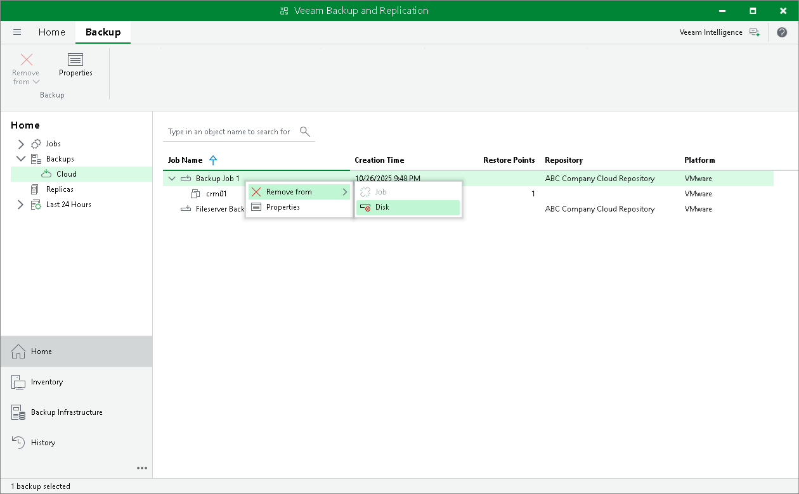

In this article

You can use the Delete from disk operation if you want to delete records about backups from the Veeam Backup & Replication console and database and, additionally, delete actual backup files from the cloud repository.

Do not delete backup files from the cloud repository manually. Use the Delete from disk option instead. If you delete backup files manually, subsequent backup job sessions will be failing.

To remove backup files from the cloud repository:

1. Open the Home view.
2. In the inventory pane, click Cloud under the Backups node.
3. In the working area, right-click the necessary backup job (or necessary Veeam Agent backup under the Agents node), clik Remove from and select Disk.

Page updated 10/26/2025

Page content applies to build 13.0.1.1071
