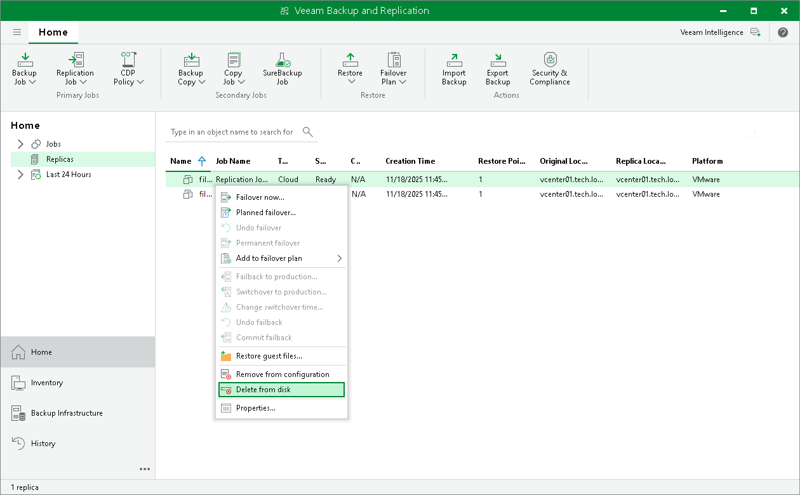

In this article

You can use the Delete from disk operation if you want to delete records about VM replicas from the Veeam Backup & Replication console and database and, additionally, delete actual replica files from the cloud host.

|  |
| --- |
| Note |
| The Delete from disk option is the only way for a tenant to delete replica files from the cloud host. The Remove from configuration operation is not available in the tenant Veeam Backup & Replication console. |

To delete replica files from the cloud host:

1. Open the Home view.
2. In the inventory pane, click the Replicas node.
3. Right-click the necessary VM replica and select Delete from disk.

Page updated 4/17/2024

Page content applies to build 13.0.1.1071
