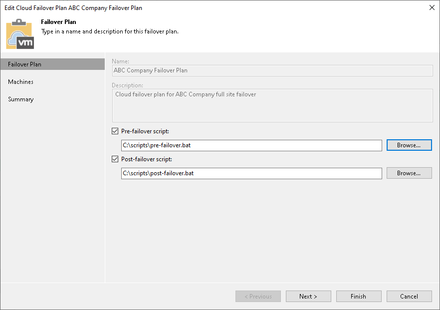

In this article

If the SP wants to execute custom scripts before and after the tenant cloud failover plan, the SP must create those scripts in advance and select them in the cloud failover plan settings before the tenant runs the cloud failover plan. For example, the SP may want to send an email to backup administrators before the failover plan is started and after the failover operation completes. Veeam Backup & Replication supports script files in BAT and CMD formats and executable files in the EXE format.

The process of specifying script settings is the same for regular cloud failover plans and cloud failover plans for VMs that have replicas in VMware Cloud Director.

|  |
| --- |
| Note |
| In the cloud failover plan settings, the SP can only specify pre-failover and post-failover scripts. The SP cannot change other failover plan settings specified by the tenant. |

To edit cloud failover plan settings:

1. Launch the Edit Cloud Failover Plan wizard:

1. Open the Cloud Connect view and click Replicas > Failover Plans in the inventory pane.
2. In the working area, click the necessary cloud failover plan and click Edit on the ribbon or right-click the necessary cloud failover plan and select Edit.

1. At the Failover Plan step of the wizard, select the Pre-failover script and Post-failover script check boxes and click Browse to choose executable files.

1. At the Virtual Machines step of the wizard, enumerate virtual machines that the tenant added to the cloud failover plan.
2. At the Summary step of the wizard, review the information about the edited hardware plan and click Finish to exit the wizard.

Page updated 1/30/2024

Page content applies to build 13.0.1.1071
