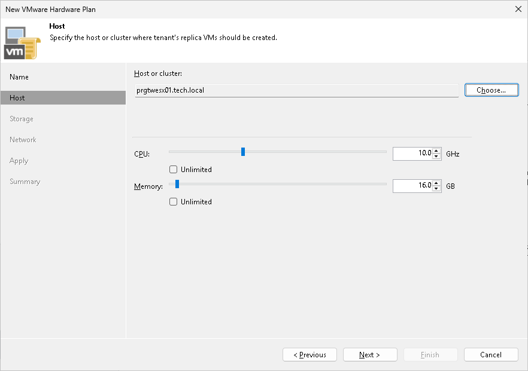

# Step 3. Specify Host or Cluster

At the Host step of the wizard, specify a host or cluster on which you want to configure a replication target.

1. In the Host or cluster section, click Choose and select the host in the SP virtualization environment on which Veeam Backup & Replication will register VM replicas created by replication jobs targeted at the cloud host.
2. In the CPU section, specify the limit of CPU resources that can be utilized by all VM replicas on the cloud host provided to the tenant through the created hardware plan. To let the tenant utilize all CPU resources available on the selected host, select the Unlimited check box.

|  |
| --- |
| Note |
| The SP should make sure that the amount of resources available for tenant VMs is sufficient for VM operation. For Hyper-V hardware plans, the limit of CPU resources must be greater than the total amount of CPU frequency on all tenant VM processor units. If the source host on the tenant side has more CPU resources than the target host on the SP side, tenant VMs may fail to start after failover due to shortage of resources. |

1. In the Memory section, specify the limit of RAM that can be utilized by all VM replicas on the cloud host provided to the tenant through the created hardware plan. To let the tenant utilize all memory resources available on the selected host, select the Unlimited check box.

