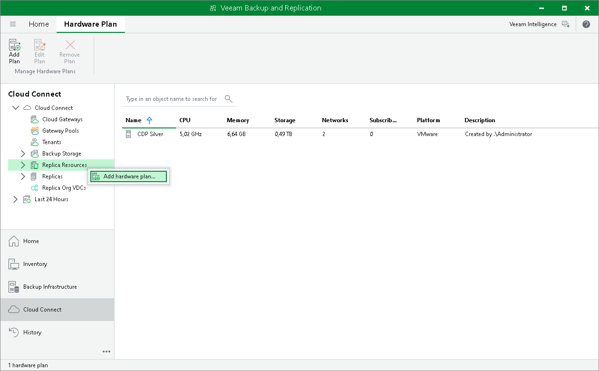

# Step 1. Launch New Hardware Plan Wizard

To launch the New VMware Hardware plan or New Hyper-V Hardware plan wizard, do one of the following:

* Open the Cloud Connect view. Click Add Plan on the ribbon and select VMware vSphere or Microsoft Hyper-V.
* Open the Cloud Connect view. Click the Replica Resources node in the inventory pane, click Add Plan on the ribbon and select VMware vSphere or Microsoft Hyper-V.
* Open the Cloud Connect view. Right-click the Replica Resources node in the inventory pane or right-click anywhere in the working area and select Add hardware plan > VMware vSphere or Add hardware plan > Microsoft Hyper-V.

