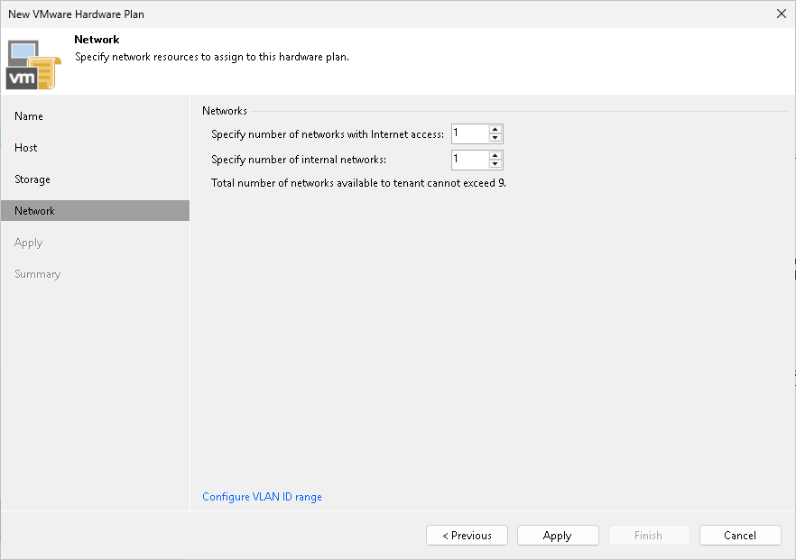

In this article

At the Network step of the wizard, specify network settings for the hardware plan.

1. [Optional] If you have not configured a range of VLANs that will be used for providing network resources to VM replicas on cloud hosts in advance before configuring a hardware plan, click the Configure VLAN ID range link at the bottom of the wizard window. Then use the VLANs Configuration dialog window to allocate the necessary number of VLANs on the virtualization host that was selected at the Host step of the wizard.

To learn more about the VLAN range configuration process, see [Managing VLANs](hardware_plan_network_vlans.md).

1. In the Specify number of networks with internet access field, specify the number of IP networks with internet access that will be available for tenant VM replicas on the cloud host.
2. In the Specify number of internal networks field, specify the number of IP networks without internet access that will be available for tenant VM replicas on the cloud host.

Page updated 1/25/2024

Page content applies to build 13.0.1.1071
