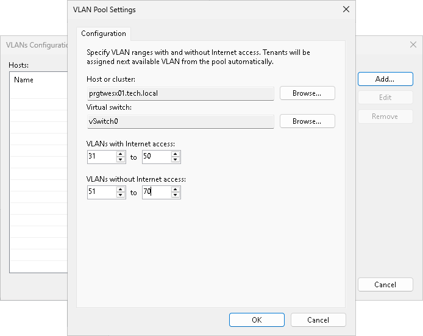
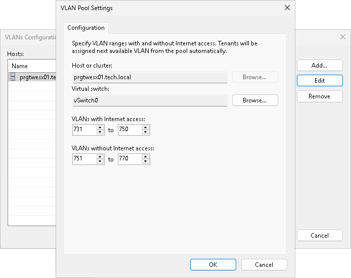
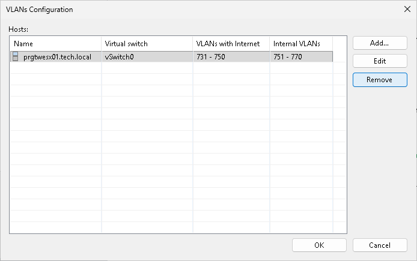

In this article

To enable networking for tenant VM replicas, the SP should configure physical switches to which hosts or clusters that will provide resources for hardware plans are connected. The SP must allocate on the physical switch a range of VLANs and reflect these settings in the Veeam Backup & Replication console using the VLANs Configuration dialog window.

In Veeam Backup & Replication, the SP can specify VLANs with internet access and VLANs without internet access. VLANs without internet access can be used as internal networks that let VM replicas communicate to each other after full site failover and to production VMs after partial site failover. For VLANs with internet access, Veeam Backup & Replication can also route traffic to the internet through the network adapter (vNIC) on the network extension appliance that is connected to the SP production network.

For example, if the SP plans to configure a hardware plan on the host named Host1 that is connected to physical switch named Switch1, the SP can pre-configure on the Switch1 a range of VLANs with IDs from 1 to 20. In the Veeam Backup & Replication console, the SP should reflect those values in accordance, for example, specify 1–10 as a range of VLANs with internet access and 11–20 as a range of VLANs without internet access.

When the SP subscribes the tenant to the hardware plan, Veeam Backup & Replication configures on the network extension appliance that is deployed on the SP side the number of network adapters (vNICs) equal to the number of networks in the hardware plan. Each network adapter connects to the dedicated VLAN from the reserved range. As a result, Veeam Backup & Replication can map every production tenant VM network to the dedicated VLAN on the SP side.

As part of the VLAN configuration process, the SP can perform the following tasks:

* [Add a VLAN range in Veeam Backup & Replication](#vlan_add).

* [Edit a VLAN range added in Veeam Backup & Replication](#vlan_edit).
* [Remove a VLAN range added in Veeam Backup & Replication](#vlan_remove).

|  |
| --- |
| Note |
| Consider the following:   * The total number of VLANs reserved for Veeam Cloud Connect Replication in the SP network infrastructure must be equal to or exceed the total number all tenant production networks.  * If the SP allocates resources for a hardware plan on a VMware or Hyper-V cluster, the SP should also configure physical switches so that they provide a trunk to broadcast traffic for all configured VLANs. * The SP does not need to allocate VLANs in Veeam Backup & Replication if the SP uses VMware Cloud Director to provide replication resources to tenants. Instead, the SP allocates the necessary number of networks in the properties of the organization VDC that will be used as a cloud host for tenant VM replicas. * The SP must avoid configuration of overlapping VLAN ranges. If one or more VLAN IDs overlap, the tenant creation process will fail. |

|  |
| --- |
| Tip |
| It is recommended that the SP plans network resources allocation and configures VLAN ranges in the Veeam Backup & Replication console in advance, prior to configuring hardware plans. However, the SP can also access the VLANs Configuration window when the SP performs the following tasks:   * Configures network resources for a hardware plan. To learn more, see [Specify Network Settings](hardware_plan_network.md). * Subscribes a tenant to a hardware plan. To learn more, see [Allocate Replication Resources](cloud_connect_user_compute_resources.md). |

Adding VLAN Ranges

To add a VLAN range in Veeam Backup & Replication:

1. Open the VLANs Configuration window in one of the following ways:

* Open the Cloud Connect view, click the Cloud Connect node and click Manage VLANs on the ribbon.
* Open the Cloud Connect view, right-click the Cloud Connect node and select Manage VLANs.

1. In the VLANs Configuration window, click Add.
2. In the VLAN Pool Settings window, click Browse next to the Host or cluster field and select a host or cluster on which you plan to configure a replication target.
3. Click Browse next to the Virtual switch field and select a virtual switch configured on the selected host on which to reserve VLANs for Veeam Cloud Connect Replication.
4. In the VLANs with Internet access fields, specify the first and the last VLAN ID in the range of VLANs that you plan to use for providing networks with internet access to VM replicas on the cloud host.
5. In the VLANs without Internet access fields, specify the first and the last VLAN ID in the range of VLANs that you plan to use for providing networks without internet access to VM replicas on the cloud host.
6. Click OK.

Editing VLAN Ranges

You can edit VLAN ranges configured in Veeam Backup & Replication, if necessary. When you change a VLAN range, tenants to whom VLANs from this range are already allocated will continue to use these VLANs. Veeam Backup & Replication will allocate new VLANs in the edited VLAN range only to those tenants who are subscribed to a hardware plan after the VLAN range was edited.

For example, you change the VLAN range from 1000–2000 to 3000–4000. In this case, VLANs 1000, 1001, and so on that are already allocated to tenants will continue to be used by these tenants. Tenants whom the SP subscribes to a hardware plan after the VLAN range was changed will receive VLANs from the new VLAN range: 3000, 3001, and so on.

To edit a VLAN range:

1. Open the VLANs Configuration window in one of the following ways:

* Open the Cloud Connect view, click the Cloud Connect node and click Manage VLANs on the ribbon.
* Open the Cloud Connect view, right-click the Cloud Connect node and select Manage VLANs.

1. In the VLANs Configuration window, select the host or cluster for which you want to edit a VLAN range, and click Edit.
2. If you want to reserve VLANs on another virtual switch configured on the selected host, in the VLAN Pool Settings window, click Browse next to the Virtual switch field and select the necessary virtual switch.
3. In the VLANs with Internet access and VLANs without Internet access fields, edit VLAN ranges as required.
4. Click OK.

Removing VLAN Ranges

You can remove a VLAN range configured in Veeam Backup & Replication, if necessary. When you remove a VLAN range, tenants to whom VLANs from this range are already allocated will continue to use these VLANs.

To remove a VLAN range:

1. Open the VLANs Configuration window in one of the following ways:

* Open the Cloud Connect view, click the Cloud Connect node and click Manage VLANs on the ribbon.
* Open the Cloud Connect view, right-click the Cloud Connect node and select Manage VLANs.

1. In the VLANs Configuration window, select the host or cluster for which you want to remove a VLAN range, and click Remove.
2. In the displayed window, click Yes. Then click OK.

Page updated 6/17/2025

Page content applies to build 13.0.1.1071
