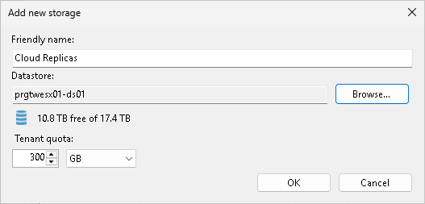
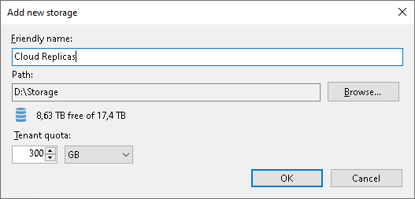
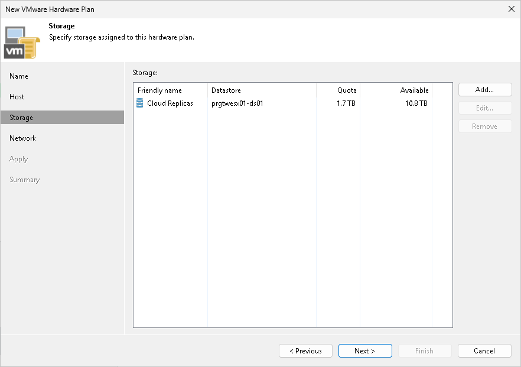

In this article

At the Storage step of the wizard, specify the storage on which Veeam Backup & Replication will store files of tenant VM replicas.

1. In the Storage section, click Add to open the Add new storage window.
2. In the Friendly name field, specify a name of the storage that will be displayed to a tenant.
3. [For a VMware hardware plan] In the Datastore section, click Browse and select a datastore on which to allocate storage resources for VM replicas.

|  |
| --- |
| Note |
| If you specified a cluster as a source of CPU and RAM resources for tenant VM replicas at the Host step of the wizard, you must use a shared datastore or datastore cluster as a storage for VM replica files. Datastores that can be accessed by a single host are not displayed in the list of available datastores at the Storage step of the wizard.  Consider the following:   * In the list of available datastores, Veeam Backup & Replication displays shared datastores that can be accessed by multiple hosts. Make sure that the shared datastore that you plan to use as a storage for tenant VM replicas is accessible by all cluster nodes. * Veeam Backup & Replication considers datastores in a datastore cluster as datastores accessible by multiple hosts. Make sure that all datastores in the datastore cluster that you plan to use as a storage for tenant VM replicas are accessible by all cluster nodes. |

1. [For a Hyper-V hardware plan] In the Path section, click Browse and specify a path to a folder on the volume that will be used for storing VM replica files.

|  |
| --- |
| Note |
| You cannot specify a Microsoft SMB3 shared folder as a storage for tenant VM replicas. |

1. In the Tenant quota section, specify the amount of disk space for the cloud host that will be provided to the tenant through the created hardware plan.
2. Click OK.

Page updated 4/17/2024

Page content applies to build 13.0.1.1071
