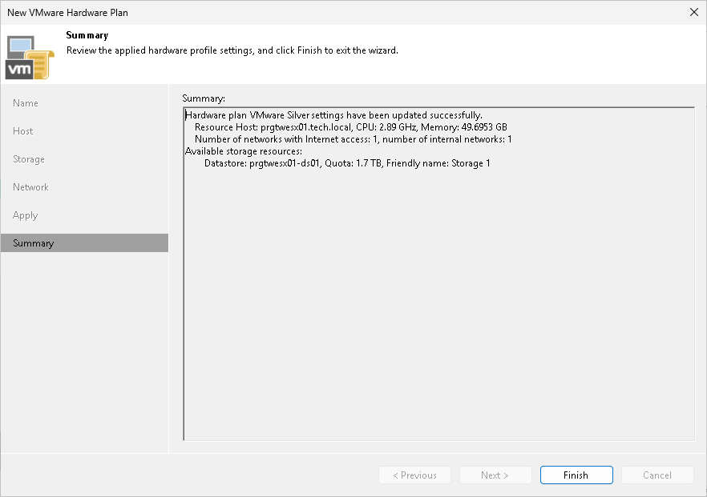

In this article

At the Summary step of the wizard, review the information about the created hardware plan and click Finish to exit the wizard.

Page updated 1/25/2024

Page content applies to build 13.0.1.1071
