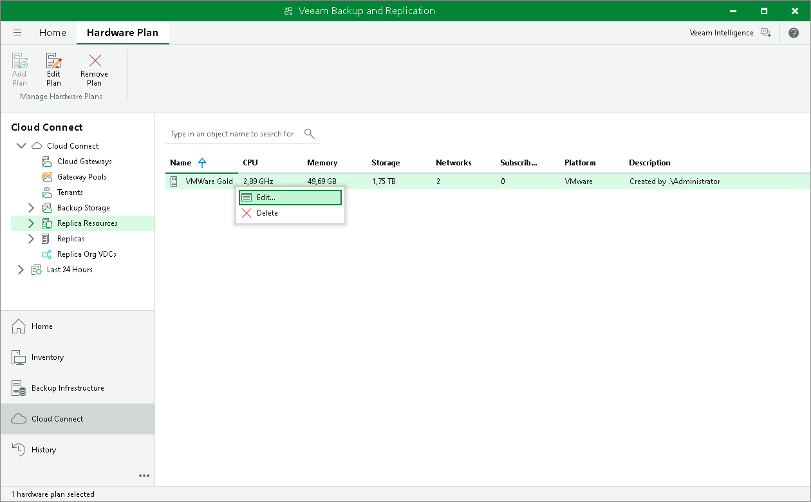

# Editing Hardware Plan Settings

You can edit settings of hardware plans you have configured.

|  |
| --- |
| Note |
| When Veeam Backup & Replication saves new hardware plan settings to the configuration database, resources provided to tenants through the edited hardware plan will become temporarily unavailable to tenants. VM replicas in Failover state after partial site failover will also become temporarily inaccessible. |

To edit settings of a hardware plan:

1. Open the Cloud Connect view.
2. In the inventory pane, click the Replica Resources node.
3. Do one of the following:

* Select the necessary hardware plan in the working area and click Edit Plan on the ribbon or right-click the necessary hardware plan and select Edit.
* Select the necessary hardware plan in the inventory pane and click Edit Plan on the ribbon or right-click the necessary hardware plan and select Edit.

1. Edit hardware plan settings as required.

|  |
| --- |
| Note |
| You cannot reduce the number of networks with internet access and the number of internal networks in the hardware plan when editing hardware plan settings. |

