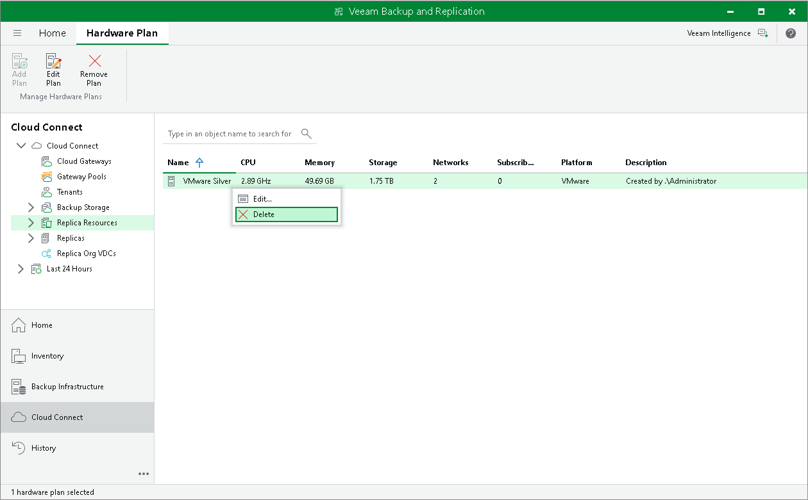

In this article

You can remove hardware plans you have configured.

|  |
| --- |
| Note |
| Before removing a hardware plan, you must first unsubscribe from this hardware plan all tenants who use resources provided through the hardware plan. |

To remove a hardware plan:

1. Open the Cloud Connect view.
2. In the inventory pane, click the Replica Resources node.
3. Do one of the following:

* Select the necessary hardware plan in the working area and click Remove Plan on the ribbon or right-click the necessary hardware plan and select Delete.
* Select the necessary hardware plan in the inventory pane and click Remove Plan on the ribbon or right-click the necessary hardware plan and select Delete.

Page updated 10/14/2025

Page content applies to build 13.0.1.1071
