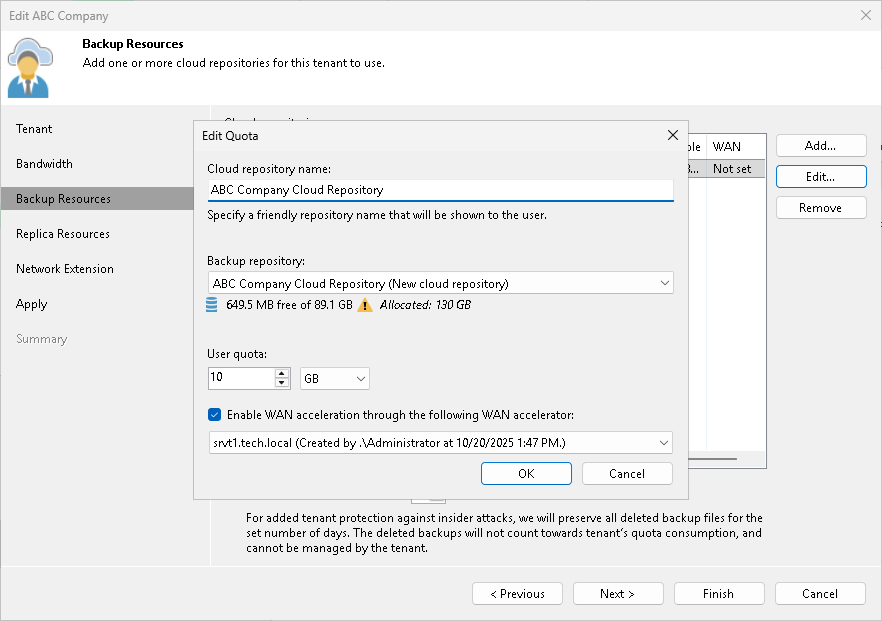
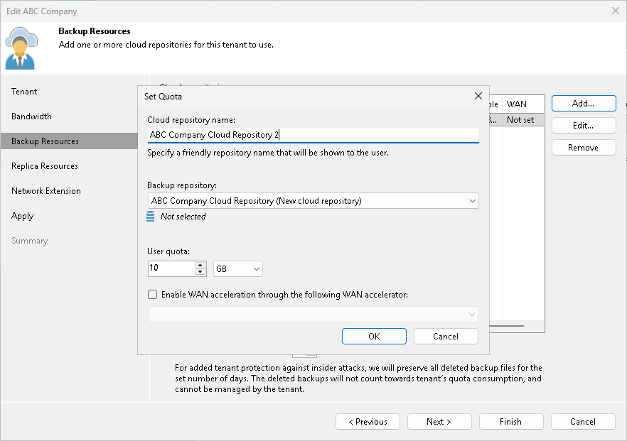
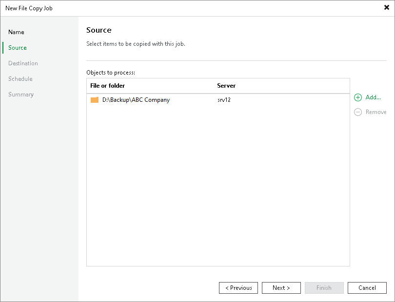
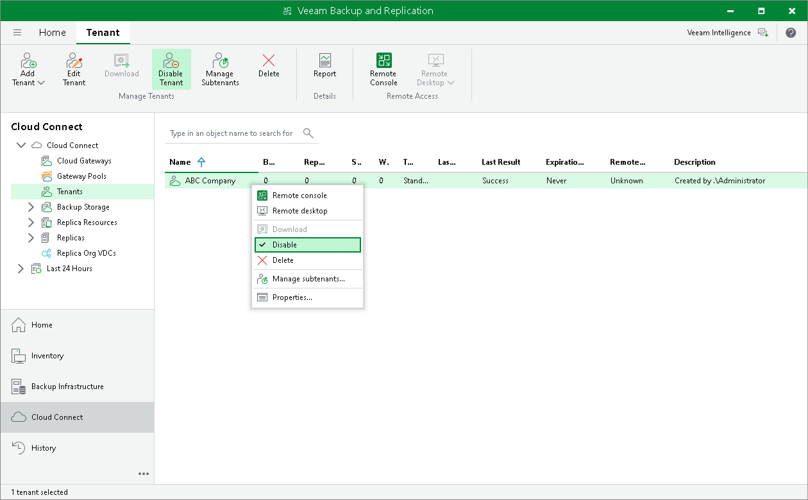
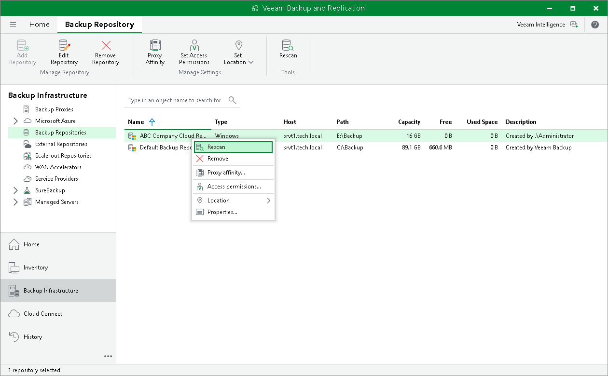
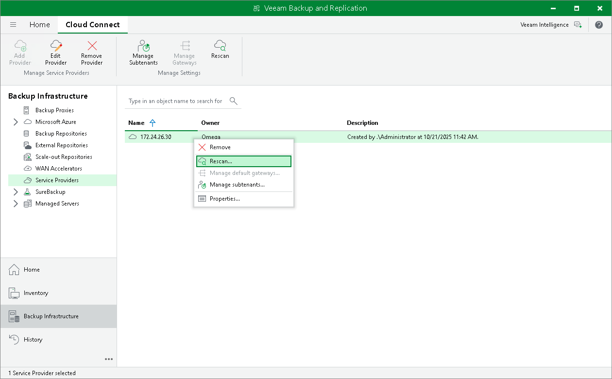
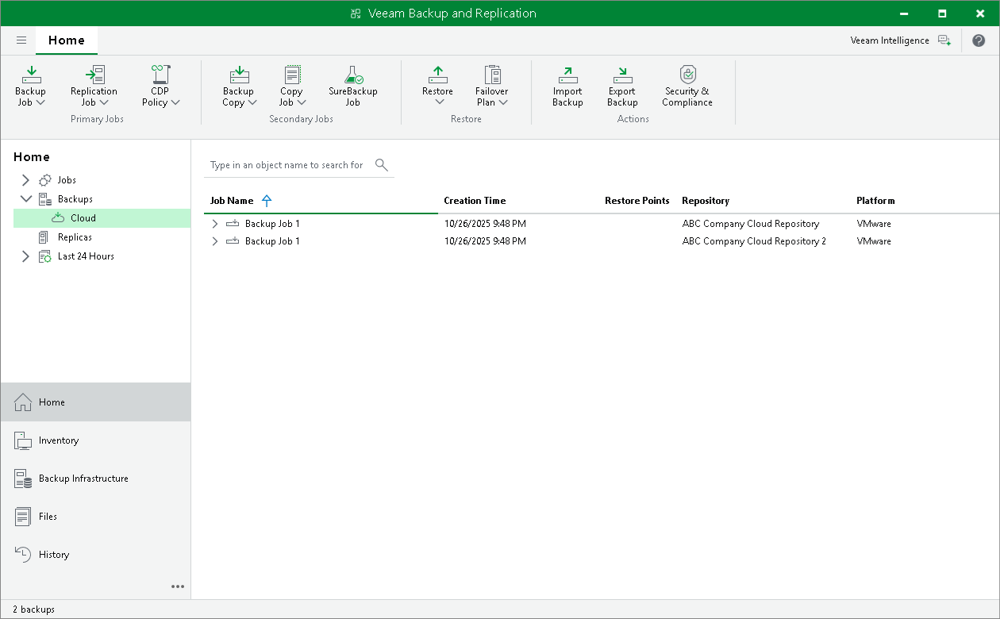
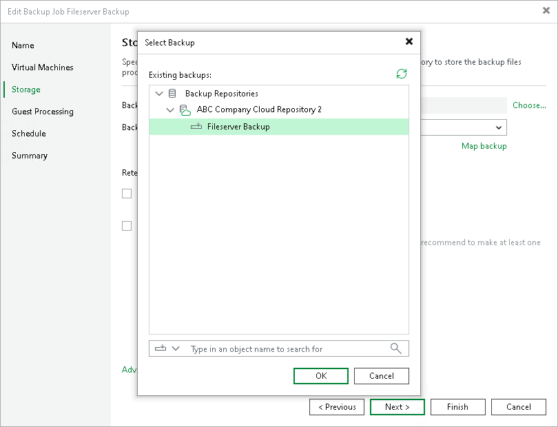
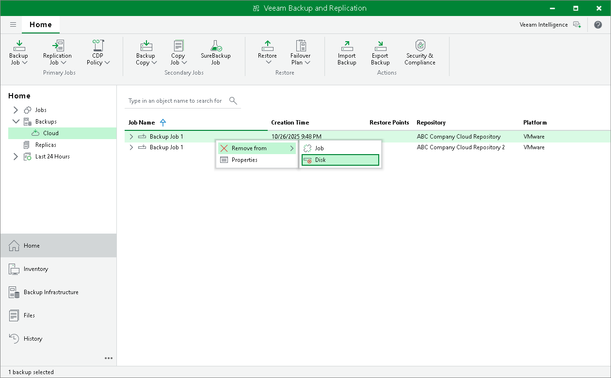

In this article

The SP may need to move tenant data to another cloud repository, for example, if the initial cloud repository is running out of space.

There are two scenarios of moving tenant data:

* [Scenario 1: replacing the cloud repository](moving_backups.md#1). The SP may want to replace the initial cloud repository with a new cloud repository, for example, with a cloud repository that has more storage capacity. This scenario does not require any actions on the tenant side.
* [Scenario 2: adding a new cloud repository](moving_backups.md#2). The SP may want to configure a new cloud repository in addition to the initial cloud repository and move tenant data to it. This scenario requires additional actions on the tenant side.

Consider the following:

* This section describes procedures of moving tenant data between regular, or simple, backup repositories used as cloud repositories. To operations that involve scale-out backup repositories, the following limitations apply:

* You can move tenant backups to a cloud repository that has a scale-out backup repository as a back end with Microsoft PowerShell cmdlet only. To learn more, see the [Switch-VBRCloudTenantsQuotaRepositoryToSOBR](https://helpcenter.veeam.com/docs/vbr/powershell/switch-vbrcloudtenantsquotarepositorytosobr.html?ver=13) section in the Veeam PowerShell Reference.

This contrasts with the same scenario in previous versions of Veeam Backup & Replication, which required you to contact [Veeam Customer Support](https://www.veeam.com/support.html).

* You cannot move tenant data to a cloud repository that has a scale-out backup repository as a back end if this repository has object storage added as a performance tier extent.

* If you want to move tenant data from a scale-out backup repository used as a cloud repository, follow instructions for the [Scenario 2](#2). You cannot use the Scenario 1 to move data from a scale-out backup repository.

|  |
| --- |
| Tip |
| You can also migrate tenant backups between performance extents within the same scale-out backup repository. To learn more, see [Migrating Tenant Data Between Performance Tier Extents](cc_sobr_migration.md). |

* You cannot move tenant data from a cloud repository that has object storage as a back end.

Scenario 1. Replacing Cloud Repository

The SP must complete the following tasks:

1. Configure a new backup repository that you plan to use as a cloud repository.
2. Disable the tenant account:

1. Open the Cloud Connect view.
2. In the inventory pane, click Tenants.
3. In the working area, right-click the tenant account and select Disable.

1. Copy a folder with tenant backup files from the initial cloud repository to the new cloud repository.

|  |
| --- |
| Important |
| Do not rescan the backup repository to which you copied tenant backup files before you replace the cloud repository as described in the step 4 of this procedure. |

1. Change resource allocation settings for the tenant on the initial cloud repository:

1. Open the Cloud Connect view.
2. In the inventory pane, click Tenants.
3. In the working area, right-click the tenant account and select Properties.
4. At the Backup Resources step of the wizard, select the initial cloud repository in the list and click Edit.
5. In the Edit Quota window, change the underlying backup repository for the initial cloud repository. To do this, from the Backup repository list, select the backup repository that you configured at the step 1.
6. If necessary, you can increase or decrease the tenant quota.
7. Click Finish to save the changes.

1. Enable the tenant account:

1. Open the Cloud Connect view.
2. In the inventory pane, click Tenants.
3. In the working area, right-click the tenant account and select Disable.

To learn more about this operation, see [Disabling and Enabling Tenant Accounts](cloud_connect_disable_account.md).

After the SP completes their tasks, the tenant may need to rescan the cloud repository in the tenant Veeam Backup & Replication console in one of the following cases:

* If the SP moved tenant data between backup repositories based on servers with different operating systems, the tenant must rescan the cloud repository.
* If the SP changed the tenant quota, the new quota becomes visible to the tenant after the next job run. Alternatively, the tenant can perform the rescan operation for the service provider or cloud repository.

To rescan the cloud repository on the tenant side:

1. In the tenant Veeam backup console, open the Backup Infrastructure view.
2. In the inventory pane, click Backup Repositories.
3. In the working area, right-click the cloud repository and select Rescan.

Scenario 2. Adding New Cloud Repository

The SP must complete the following tasks:

1. Configure a new backup repository that you plan to use as a cloud repository.
2. On a newly configured cloud repository, allocate resources to the tenant:

1. Open the Cloud Connect view.
2. In the inventory pane, click Tenants.
3. In the working area, right-click the tenant account and select Properties.
4. At the Backup Resources step of the wizard, click Add and allocate resources on the new cloud repository to the tenant.
5. Click Finish to save the changes.

1. Disable the tenant account:

1. Open the Cloud Connect view.
2. In the inventory pane, click Tenants.
3. In the working area, right-click the tenant account and select Disable.

1. Copy a folder with tenant backup files from the initial cloud repository to the new cloud repository.

If you move tenant backups from a scale-out backup repository, make sure to copy all folders with tenant backup files from repository extents.

1. Enable the tenant account:

1. Open the Cloud Connect view.
2. In the inventory pane, click Tenants.
3. In the working area, right-click the tenant account and select Disable.

To learn more about this operation, see [Disabling and Enabling Tenant Accounts](cloud_connect_disable_account.md).

1. Rescan the new cloud repository:

1. In the SP Veeam Backup & Replication console, open the Backup Infrastructure view.
2. In the inventory pane, click Backup Repositories.
3. In the working area, right-click the backup repository that is exposed as a new cloud repository and select Rescan.

|  |
| --- |
| Important |
| Do not delete backup files on the initial cloud repository at this moment. It is strongly recommended that you delete backup files after the tenant completes the data migration procedure on their backup server and ensures no data is lost. |

The tenant must complete the following tasks:

1. Rescan the service provider:

1. In the tenant Veeam Backup & Replication console, open the Backup Infrastructure view.
2. In the inventory pane, click Service Providers.
3. In the working area, right-click the service provider and select Rescan.

1. Enumerate backups on the new cloud repository.

Backups that reside in the new cloud repository will appear in the Home view next to backups that were created in the initial cloud repository.

Unencrypted backups will be displayed under the Backups > Cloud node. Encrypted backups will be displayed under the Backups > Cloud (Encrypted) node. To unlock backups:

1. Select the Backups > Cloud (Encrypted) node, right-click the backup in the working area and select Specify password.
2. In the Specify Password window, type in the password for the backup.

Unlocked backups will be moved under the Backups > Cloud node.

1. Map backup jobs and backup copy jobs to backups on the new cloud repository:

1. Open the Home view.
2. In the inventory pane, click Jobs.
3. In the working area, right-click the job that you want to edit and select Edit.
4. At the Storage (for backup jobs) or Target (for backup copy) step of the wizard, select the new cloud repository from the Backup repository list.
5. Click Map backup.
6. In the Select Backup window, choose the backup job and click OK.
7. Save the job settings.
8. Repeat steps c–g for all jobs that whose backups have been moved.

1. After the tenant makes sure that backups have been successfully copied and mapped to jobs, the tenant can delete backup files from the initial cloud repository:

1. Open the Home view.
2. In the inventory pane, click Backups > Cloud.
3. In the working area, right-click the backup job whose backups you want to remove and select Delete from disk.
4. Repeat steps b–c for all jobs whose backups whose backups have been moved.

|  |
| --- |
| Important |
| Make sure that you do not delete backup files from the new cloud repository instead of the initial cloud repository. |

Page updated 11/19/2025

Page content applies to build 13.0.1.1071
