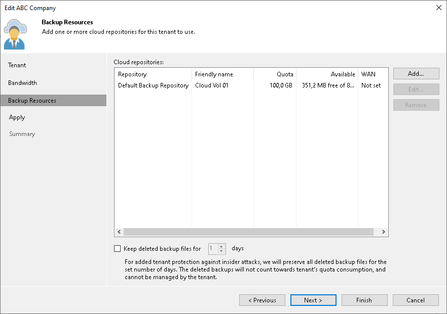
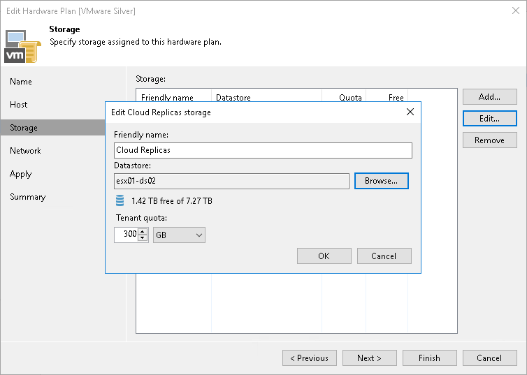
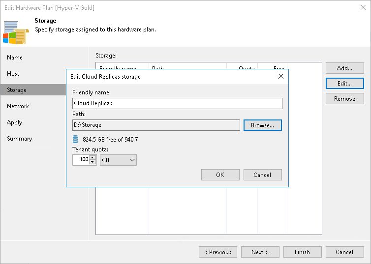
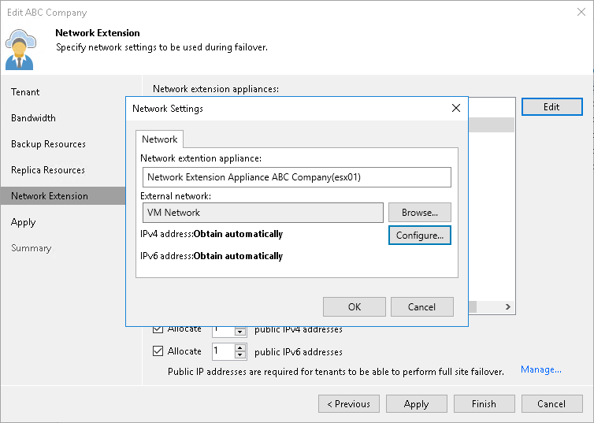

In this article

The SP may need to move tenant VM replica files to another location, for example, if the initial storage is running out of space. This operation can be performed on the VMware vSphere platform as well as on the Microsoft Hyper-V platform.

The operation does not require any actions on the tenant side. For the tenant, VM replica files remain on the same cloud host, in the same cloud storage.

|  |
| --- |
| Important |
| It is not recommended that the SP or tenant move tenant VM replicas created in VMware Cloud Director to another vApp. During this operation, all restore points created for VM replicas except for the latest restore point will be deleted. |

Before you move tenant replica files, check the following prerequisites:

* The new datastore (for VMware vSphere platform) or storage volume (for Microsoft Hyper-V platform) must be connected to the same host or cluster as the initial datastore/volume.
* All active replication job sessions and failover tasks must be stopped for VM replicas created by tenants whose replica files are moved to another datastore/volume.

|  |
| --- |
| Note |
| When you move tenant replicas to a new location, you must change the storage location in the settings of the hardware plan that utilized storage resources of the initial location (datastore or volume). As a result, you can move to a new location only all replicas created by tenants that are subscribed to this hardware plan at once.  For example, Tenant 1 and Tenant 2 are subscribed to the same VMware hardware plan and their VM replica files are kept on the same datastore. In this case, you cannot move replicas created by Tenant 1 to a new datastore and let replicas created by Tenant 2 remain on the initial datastore. Instead, you need to move all replicas created by Tenant 1 and Tenant 2 to a new datastore. |

The SP must complete the following tasks:

1. Remove the SP-side network extension appliances used by tenant VM replicas in the initial location.

1. Open the Cloud Connect view.
2. In the inventory pane, click Tenants.
3. In the working area, right-click the necessary tenant and select Properties.
4. At the Replica Resources step of the wizard, clear the Use built-in network management capabilities during failover check box.
5. Click Finish.
6. [Optional] If more than one tenant is subscribed to the hardware plan that utilizes storage resources of the initial VM replica location, repeat steps a–e for each tenant whose replicas you plan to move to a new location.

1. Move tenant data from the initial location to the new location:

* [For VMware vSphere] Use Storage vMotion to move tenant VM replicas to the new datastore.
* [For Microsoft Hyper-V] Use the Move option in Hyper-V Manager (or Failover Cluster Manager) to move tenant VM replicas to a path on the new storage volume.

1. Change storage allocation settings in the hardware plan settings:

1. Open the Cloud Connect view.
2. In the inventory pane, click Replica Resources.
3. In the working area, right-click the hardware plan for which you want to change storage settings and select Edit Hardware Plan.
4. At the Storage step of the wizard, select the cloud storage that uses quota on the initial storage from which VM replicas have been moved and click Edit.
5. In the Edit Storage window, change the datastore/path for the cloud storage:

* [For VMware Hardware Plan] In the Datastore section, click Browse and select the datastore to which VM replicas have been moved.

* [For Hyper-V Hardware Plan] In the Path section, click Browse and specify a path to the folder to which VM replicas have been moved.

1. Click OK.

1. At the Apply step of the wizard, wait until Veeam Backup & Replication updates the hardware plan settings. Then click Finish.

1. Deploy the new SP-side network extension appliances in the new location where you have moved tenant VM replicas.

1. Open the Cloud Connect view.
2. In the inventory pane, click Tenants.
3. In the working area, right-click the necessary tenant and select Properties.
4. At the Replica Resources step of the wizard, select the Use built-in network management capabilities during failover check box.
5. At the Network Extension step of the wizard, specify settings for the new SP-side network extension appliance that will be used by tenant VM replicas in the new location. To learn more, see [Specify Network Extension Settings](cloud_connect_user_network_failover.md).
6. Click Apply. Then click Finish.
7. [Optional] If more than one tenant is subscribed to the hardware plan that utilizes storage resources of the new VM replica location, repeat steps a–e for each tenant whose replicas you have moved to the new location.

Veeam Backup & Replication will deploy the new SP-side network extension appliances on the datastore or storage volume where you have moved tenant VM replicas. Tenants subscribed to the hardware plan will be able to continue running replication jobs and performing failover tasks targeted at the cloud host.

Page updated 1/30/2024

Page content applies to build 13.0.1.1071
