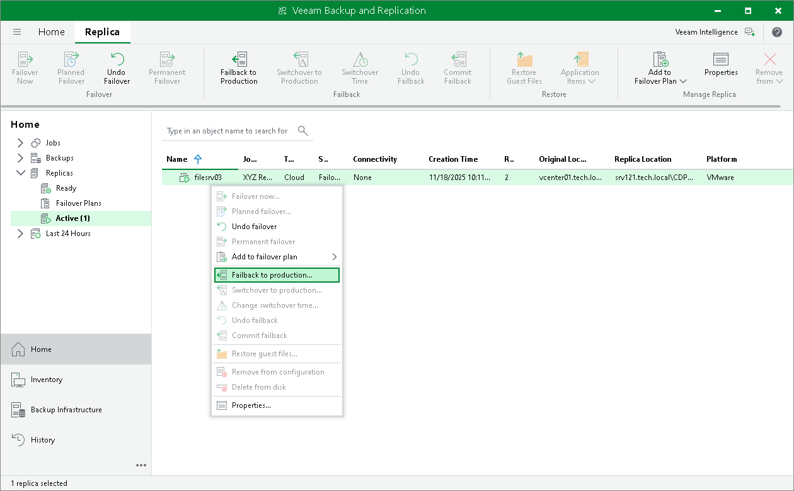

In this article

You can resume operation of a production VM by failing back to it from a VM replica on the cloud host. Performing failback for VM replicas on the cloud host is similar to performing failback for regular VM replicas. To learn more, see the [Performing Failback](https://helpcenter.veeam.com/docs/vbr/userguide/performing_failback.html?ver=13) section in the Veeam Backup & Replication User Guide.

To launch the Failback wizard, do one of the following:

* Open the Home view and select the Replicas node. In the working area, select the necessary VM and click Failback to Production on the ribbon.
* Open the Home view and select the Replicas node. In the working area, right-click the necessary VM and select Failback to production.

Committing Failback

The Commit failback operation finalizes failback from the VM replica to the original VM.

To commit failback, do one of the following:

* Open the Home view, in the inventory pane select Replicas. In the working area, select the necessary replica and click Commit Failback on the ribbon.
* Open the Home view, in the inventory pane select Replicas. In the working area, right-click the necessary replica and select Commit failback.
* On the Home tab, click Restore. In the Restore from replica section, select Commit failback.

In the displayed window, click Yes to confirm the operation.

Page updated 11/11/2025

Page content applies to build 13.0.1.1071
