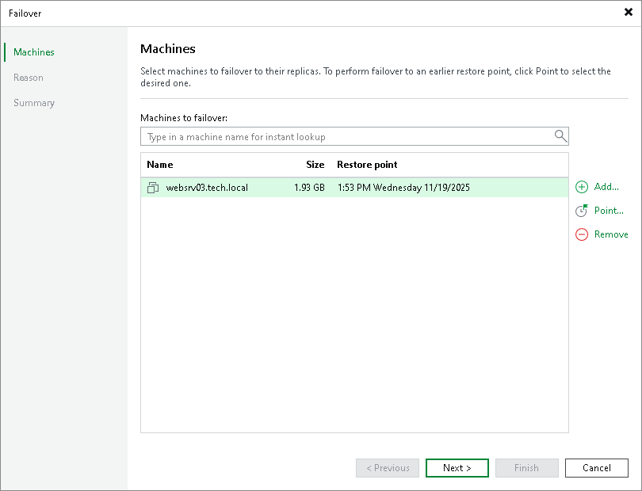
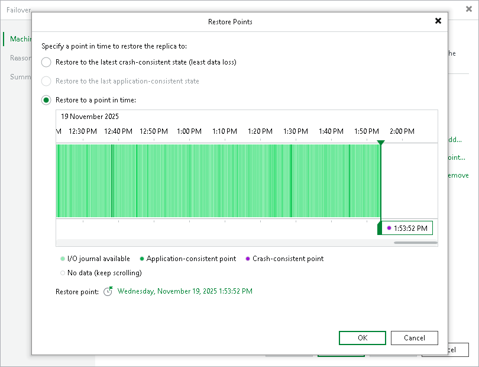

In this article

If one or several production VMs become corrupted, but the rest of production site, including the most critical VMs and Veeam Backup & Replication infrastructure, remain operative, you can perform partial site failover. With partial site failover, you can quickly recover a corrupted VM by failing over to its CDP replica on the cloud host.

|  |
| --- |
| Important |
| You can perform partial site failover only for those VMs that have a static IP address. If a VM receives an IP address from DHCP, the failover operation will succeed but the VM replica will not be accessible over the network. |

To perform partial-site failover to a CDP replica, do the following:

1. Launch the failover wizard in one of the following ways:

* Open the Home view and select the Replicas node. In the working area, select the necessary VM and click Failover Now on the ribbon.
* Open the Home view and select the Replicas node. In the working area, right-click the necessary VM and select Failover now.
* Open the Home view and select Ready under the Replicas node. In the working area, select the necessary replica and click Failover Now on the ribbon or right-click the replica and select Failover now.

|  |
| --- |
| Note |
| If you have not deployed the network extension appliance for the network to which the corrupted VM is connected, Veeam Backup & Replication will display a warning. You can proceed to the Network Extension step of the Service Provider wizard to configure and deploy the missing network extension appliance. To learn more, see [Configure Network Extension Appliances](cloud_connect_sp_network_appliance.md).  After the network extension appliance is deployed, you can launch the Failover wizard to start the partial site failover operation. |

1. At the Machines step of the wizard, select one or more VMs for which you want to perform failover.
2. By default, Veeam Backup & Replication uses the latest valid restore point of the VM replica. If you want to fail over to an earlier state of the VM, select the VM in the Virtual machines to failover list and click Point.

1. In the Restore Points window, select whether you want to fail over to the latest available crash-consistent restore point, to the latest long-term application-consistent restore point or to a specific point in time.

If you fail over to a specific point in time, use the right and left arrows on the keyboard to select the required restore point.

To quickly find a long-term restore point, in the Restore point field click a link that shows a date. In the displayed window, use the calendar to select the necessary day, and then select a long-term restore point created during the selected day. The colour indicates the amount of data traffic for each time point.

1. At the Reason step of the wizard, specify the reason for failing over to the VM replicas for future reference.

1. At the Summary step of the wizard, review details of the failover task and click Finish to exit the wizard. When the failover process is complete, the VM replicas will be started on the cloud host.

Page updated 11/19/2025

Page content applies to build 13.0.1.1071
