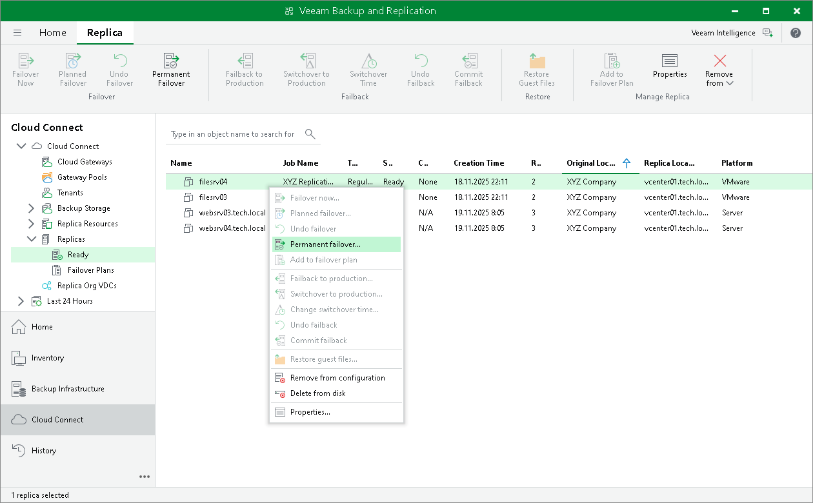

# Performing Permanent Failover

The SP can perform the permanent failover operation if the tenant wants to permanently switch from the original VM to a VM replica on the cloud host and use this replica as the original VM.

To perform permanent failover, do either of the following:

* Open the Cloud Connect view, in the inventory pane select Replicas. In the working area, select the necessary VM and click Permanent Failover on the ribbon.
* Open the Cloud Connect view, in the inventory pane select Replicas. In the working area, right-click the necessary VM and select Permanent failover.

In the displayed window, click Yes to confirm the operation.

After the permanent failover operation completes, the VM replica is put to the Permanent failover state. To protect the VM replica from corruption after performing permanent failover, Veeam Backup & Replication reconfigures the replication job and adds the original VM to the list of exclusions. When the replication job that processes the original VM starts, the VM will be skipped from processing, and no data will be written to the working VM replica.

