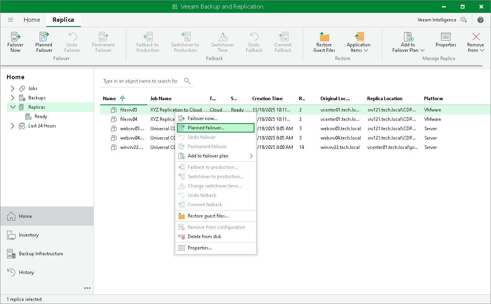

In this article

Within the partial site failover scenario, you can perform planned failover for replicas on the cloud host. This operation is supported for both snapshot-based replicas and CDP replicas. This operation is helpful if you know that your production VMs are about to go offline and you need to proactively switch the workload from source VMs to their replicas on the cloud host.

During planned failover, Veeam Backup & Replication triggers the replication job to fully synchronize the replica with the source VM, shuts down the source VM and fails over the VM to its replica. To learn more, see the [Planned Failover](https://helpcenter.veeam.com/docs/vbr/userguide/planned_failover.html?ver=13) section in the Veeam Backup & Replication User Guide.

To launch the Planed Failover wizard, do one of the following:

* Open the Home view and select the Replicas node. In the working area, select the necessary VM and click Planned Failover on the ribbon.
* Open the Home view and select the Replicas node. In the working area, right-click the necessary VM and select Planned failover.
* Open the Home view and select Ready under the Replicas node. In the working area, select the necessary replica and click Planned Failover on the ribbon or right-click the replica and select Planned failover.

Page updated 11/11/2025

Page content applies to build 13.0.1.1071
