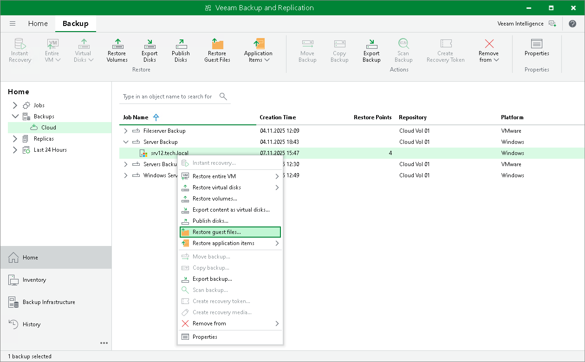

# Performing Restore

You can perform the following data recovery tasks with backups that reside in the cloud repository:

* Restore:

* [Entire VM restore](cloud_connect_vm_restore.md)

* [VMware Cloud Director restore](cloud_connect_vcd_restore.md) (for VMware vSphere platform)
* [VM files restore](cloud_connect_vm_files.md)
* [VM disks restore](cloud_connect_disk_restore.md) (for VMware vSphere platform)
* [VM guest OS files restore](cloud_connect_guest_restore.md) (Microsoft Windows FS only. Multi-OS restore is not supported.)
* [Application items restore](cloud_connect_app_restore.md)
* [Volume restore](cloud_connect_volume_restore.md) (for Veeam Agent backups)
* [Disk export](cloud_connect_disk_restore_agent.md) (for Veeam Agent backups)
* [Guest OS files restore](cloud_connect_guest_restore_agent.md) (for Veeam Agent backups)
* [Disk publishing](publishing_disks.md)

* [Backup export](cloud_connect_export_backup.md)
* [File copy](cloud_connect_copy_manual.md) (manual operations)

|  |
| --- |
| Note |
| Consider the following:   * If you allowed the SP to manage the tenant backup server, the SP can use the SP backup console to perform selected data recovery operations from tenant backups. To learn more, see [Restoring Data from Tenant Backups](cc_data_restore.md). * If you create Veeam Agent backups in the cloud repository, you can also restore data from such backups using Veeam Recovery Media. To learn more, see the Restoring from Veeam Recovery Media sections in the [Veeam Agent for Microsoft Windows User Guide](https://helpcenter.veeam.com/archive/agentforwindows/13/userguide/overview.html) and [Veeam Agent for Linux User Guide](https://helpcenter.veeam.com/docs/agentforlinux/userguide/overview.html?ver=13). * If Nutanix AHV Plug-in is installed and a Nutanix AHV cluster is added in Veeam Backup & Replication, you can perform instant recovery to Nutanix AHV from backups that reside in the cloud repository. For more information, see the [Instant Recovery](https://helpcenter.veeam.com/docs/vbahv/userguide/instant_recovery.html?ver=9) section in the Veeam Backup for Nutanix AHV User Guide. |

Backups created on the cloud repository are displayed under the Backups > Cloud node in the inventory pane of the Home view.

Backups created by Veeam Agent operating in the standalone mode are displayed under the Agents node in the working area of the Backups > Cloud node.

