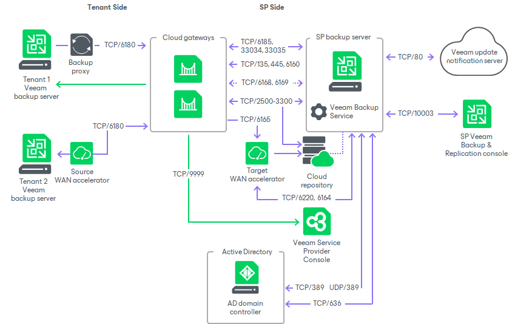
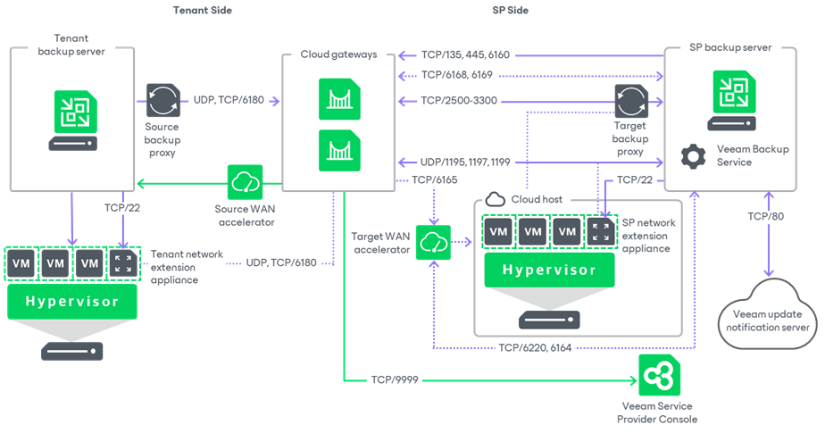
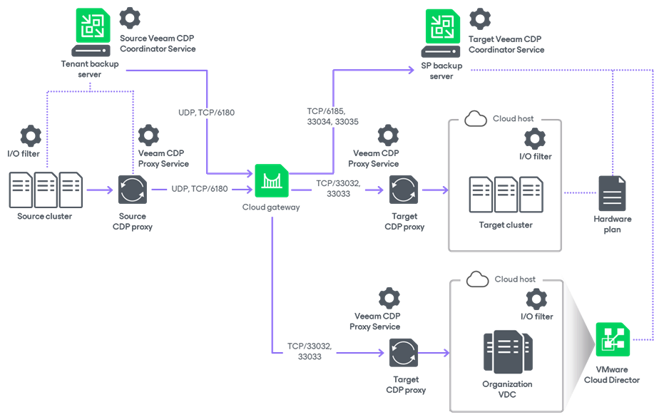
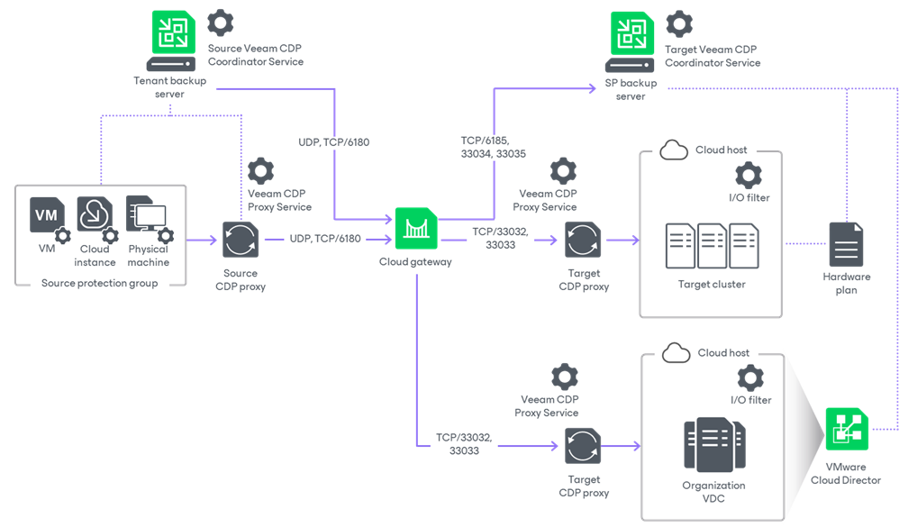
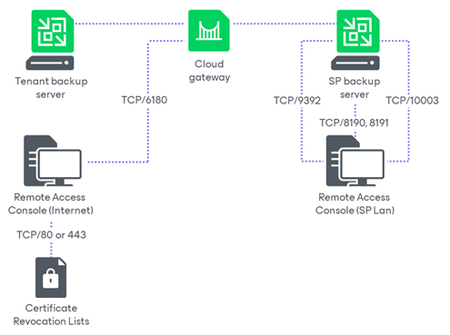

# Ports

The following table describes network ports that must be opened to ensure proper communication of the Veeam Cloud Connect infrastructure components.

To learn what ports are required for other Veeam Backup & Replication components in the Veeam Cloud Connect infrastructure, see the [Ports](https://helpcenter.veeam.com/docs/vbr/userguide/used_ports.html?ver=13) section in the Veeam Backup & Replication User Guide.

In this section, you can also find diagrams illustrating the interaction between Veeam Cloud Connect components and used ports in following scenarios:

* [Ports in Backup Scenarios](#backup_ports)
* [Ports in Snapshot-Based Replication Scenarios](#replication_ports)
* [Ports in CDP Replication Scenarios](#cdp_replication_ports)
* [Ports in Universal CDP Replication Scenarios](#universal_cdp_replication_ports)
* [Ports in Remote Access Console Scenarios](#rac_ports)

| From | To | Protocol | Port | Notes |
| --- | --- | --- | --- | --- |
| Cloud gateway | SP backup server | TCP | 6169 | Port on the SP backup server used to listen to cloud commands from the tenant side. Tenant cloud commands are passed to the Veeam Cloud Connect Service through the cloud gateway. |
| TCP | 8190, 8191 | Port on the SP backup server used by SP-side network redirectors to connect to the Remote Access Console and establish a Remote Desktop Connection to tenant. |
| TCP | 2500 to 5000 | Port range used during transfer of the Veeam Service Provider Console agent from the SP backup server to the tenant backup server. |
| TCP | 6185, 33034, 33035 | Ports on the SP backup server used for communication with the Veeam CDP Coordinator Service.  For the complete list of ports used in the CDP infrastructure, see the [CDP Components](https://helpcenter.veeam.com/docs/vbr/userguide/used_ports.html?ver=13#cdp-components) section in the Veeam Backup & Replication User Guide. |
| SP backup repository | TCP | 2500 to 3300 | Default range of ports used as data transmission channels. For every TCP connection that a job uses, one port from this range is assigned.  Note: This range of ports applies to newly installed Veeam Backup & Replication starting from version 10.0, without upgrade from previous versions. If you have upgraded from an earlier version of the product, the range of ports from 2500 to 5000 applies to the already added components. |
| SP backup proxy | TCP | 2500 to 3300 | Default range of ports used as data transmission channels. For every TCP connection that a job uses, one port from this range is assigned.  For replication of Microsoft Hyper-V VMs, the SP backup proxy resides on the target Hyper-V host.  For replication of VMware vSphere VMs, the role of the backup proxy can be assigned to the backup server or another machine in the Veeam backup infrastructure.  Note: This range of ports applies to newly installed Veeam Backup & Replication starting from version 10.0, without upgrade from previous versions. If you have upgraded from an earlier version of the product, the range of ports from 2500 to 5000 applies to the already added components. |
| SP CDP proxy | TCP | 33032, 33033 | Default ports used as transmission channels to the target CDP proxy.  For the complete list of ports used in the CDP infrastructure, see the [CDP Components](https://helpcenter.veeam.com/docs/vbr/userguide/used_ports.html?ver=13#cdp-components) section in the Veeam Backup & Replication User Guide. |
| Provider-side network extension appliance | UDP | 1195 | Port used to establish secure VPN connection for network extension during partial site failover.  If a tenant has several IP networks, additional odd ports should be opened starting from 1195 — one port per tenant IP network.  For example, a tenant Tenant1 replicates VMs that are connected to 3 IP networks. In the Veeam Cloud Connect infrastructure, the SP deployed a network extension appliance for Tenant1. In this case, the SP needs to open between the network extension appliance and the cloud gateway the following ports: 1195, 1197, 1199. |
| WAN accelerator | TCP | 6165 | Default port used for data transfer between WAN accelerators. |
| Veeam Service Provider Console server | TCP | 9999 | Port on the Veeam Service Provider Console server used to communicate with the tenant backup server.  Communication between tenant backup servers and Veeam Service Provider Console server goes through cloud gateways. |
| SP backup server | Cloud gateway | TCP | 135, 445 | Ports used for deploying Veeam Backup & Replication components. |
| TCP | 6160 | Default port used by the Veeam Installer Service for deployment of the Veeam Cloud Gateway Service and during failover operations. |
| TCP | 6168 | Port on the cloud gateway used to listen for cloud commands from the Veeam Cloud Connect Service. The service cloud commands from the Veeam Cloud Connect Service are sent to set up, delete and check the status of data transport channels between tenants and the cloud repository. |
| TCP | 2500 to 3300 | Default range of ports used as data transmission channels. For every TCP connection that a job uses, one port from this range is assigned.  Note: This range of ports applies to newly installed Veeam Backup & Replication starting from version 10.0, without upgrade from previous versions. If you have upgraded from an earlier version of the product, the range of ports from 2500 to 5000 applies to the already added components. |
| Provider-side network extension appliance | TCP | 22 | Port used for communication with the network extension appliance. |
| ICMP | — | SP backup server needs access to the SP network extension appliance over ICMP. |
| Domain controller | TCP and UDP | 389 | Port used for LDAP connections to Active Directory domain controllers for Active Directory tenants authentication. |
| TCP | 636 | Ports used for LDAPS connections to Active Directory domain controllers for Active Directory tenants authentication. |
| WAN accelerator | TCP | 6164 | Controlling port for RPC calls. |
| TCP | 6220 | Port used for traffic control (throttling) for tenants that use WAN accelerators. |
| SP backup repository | TCP | 2500 to 3300 | Default range of ports used as data transmission channels. For every TCP connection that a job uses, one port from this range is assigned. |
| SP backup repository | Cloud gateway | TCP and UDP | 6180 | Port used for connections during the following operations:   * Creating a replica from a cloud backup * Replica seeding from a cloud backup |
| SP Veeam Backup & Replication console | SP backup server | TCP | 10003 | Port used by the Veeam Backup & Replication console to connect to the backup server when managing the Veeam Cloud Connect infrastructure. |
| Tenant Veeam Backup & Replication console | Cloud gateway | TCP | 6180 | Port used by the Veeam Software Appliance (VSA) to connect to the cloud gateway when managing the Veeam Cloud Connect infrastructure. |
| Tenant backup server | Cloud gateway | TCP and UDP | 6180 | Port on the cloud gateway used to transport VM data from the tenant side to the SP side (UDP is used only during partial failover of a cloud replica). |
| Tenant-side network extension appliance | TCP | 22 | Port used for communication with the network extension appliance. |
| Certificate Revocation Lists | TCP | 80 or 443 (most popular) | Tenant backup server needs access to CRLs (Certificate Revocation Lists) of the CA (Certification Authority) who issued a certificate to the SP.  Generally, information about CRL locations can be found on the CA website. |
| Endpoint used by the Automatic Root Certificates Update component | TCP | 443 | Port used by the Automatic Root Certificates Update component for communication with the Windows Update endpoint.  Applicable to Microsoft Windows 10 and later, Microsoft Windows Server 2016 and later.  To learn more, see [Microsoft documentation](https://docs.microsoft.com/en-us/windows/privacy/manage-windows-endpoints#certificates). |
| Backup server | Veeam Update Notification Server (dev.veeam.com) | TCP | 80 | Default port used to download information about available updates from the Veeam Update Notification Server over the internet. |
| Veeam License Update Server (autolk.veeam.com) | TCP | 443 | Default port used for license auto-update. |
| Backup server | TCP | 10003 | Port used for communication with the Veeam Backup Service (locally on the backup server). |
| Provider-side network extension appliance | Cloud gateway | UDP | 1195 | Port used to establish secure VPN connection for network extension during partial site failover.  If a tenant has several IP networks, additional odd ports should be opened starting from 1195 — one port per tenant IP network.  For example, a tenant Tenant1 replicates VMs that are connected to 3 IP networks. In the Veeam Cloud Connect infrastructure, the SP deployed a network extension appliance for Tenant1. In this case, the SP needs to open between the network extension appliance and the cloud gateway the following ports: 1195, 1197, 1199. |
| Tenant-side network extension appliance | Cloud gateway | TCP and UDP | 6180 | Port used to carry tenant VM traffic from the tenant network extension appliance to the SP network extension appliance through the cloud gateway. |
| Tenant backup proxy (VMware vSphere) or Hyper-V server / off-host backup proxy (Microsoft Hyper-V) | Cloud gateway | TCP and UDP | 6180 | Port used for VM data transport to the cloud repository by backup jobs and replication jobs. |
| Tenant backup repository (Microsoft Windows server / Linux server / gateway server for CIFS share) | Cloud gateway | TCP and UDP | 6180 | Port used for VM data transport to the cloud repository by backup copy jobs. |
| Tenant CDP proxy | Cloud gateway | TCP and UDP | 6180 | Port used for VM data transport by CDP policies targeted at the cloud host.  For the complete list of ports used in the CDP infrastructure, see the [CDP Components](https://helpcenter.veeam.com/docs/backup/vsphere/used_ports.html?ver=120#cdp-components) section in the Veeam Backup & Replication User Guide. |
| Remote Access Console (SP LAN) | SP backup server | TCP | 8191 | Port used for communication with the Veeam Cloud Connect Service and SP-side network redirectors. |
| TCP | 9392 | Port used for communication with the Veeam Backup Service. |
| TCP | 10003 | Port used for communication with the Veeam Backup Service. |
| Remote Access Console (Internet) | Cloud gateway | TCP | 6180 | Default port used for communication with the SP Veeam Cloud Connect Service and SP-side network redirectors. |
| Certificate Revocation Lists | TCP | 80 or 443 (most popular) | Remote Access Console needs access to CRLs (Certificate Revocation Lists) of the CA (Certification Authority) who issued a certificate to the SP.  Generally, information about CRL locations can be found on the CA website. |
| Tenant Hyper-V server | Cloud gateway | TCP and UDP | 6180 | Port used for data transport during full VM restore. |
| Veeam Agent computer (Microsoft Windows, Linux, macOS) | Cloud gateway | TCP | 6180 | Port on the cloud gateway used to transport Veeam Agent data to the cloud repository. |
| Certificate Revocation Lists | TCP | 80 or 443 (most popular) | Veeam Agent computer needs access to CRLs (Certificate Revocation Lists) of the CA (Certification Authority) who issued a certificate to the SP.  Generally, information about CRL locations can be found on the CA website |

Ports in Backup Scenarios

The following diagram illustrates the interaction between Veeam Cloud Connect components and used ports in backup scenarios.

Ports in Snapshot-Based Replication Scenarios

The following diagram illustrates the interaction between Veeam Cloud Connect components and used ports in snapshot-based replication scenarios.

Ports in CDP Scenarios

The following diagram illustrates the interaction between Veeam Cloud Connect components and used ports in CDP replication scenarios.

Ports in Universal CDP Scenarios

The following diagram illustrates the interaction between Veeam Cloud Connect components and used ports in Universal CDP replication scenarios.

Ports in Remote Access Console Scenarios

The following diagram illustrates the interaction between Veeam Cloud Connect components and used ports in the Remote Access Console scenarios.

