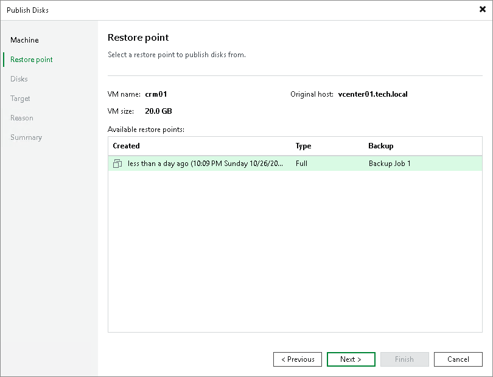
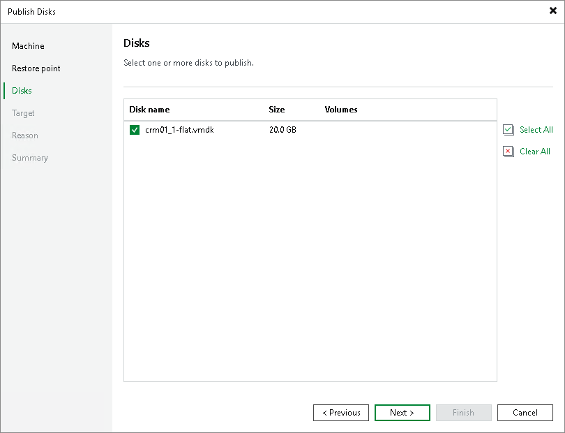
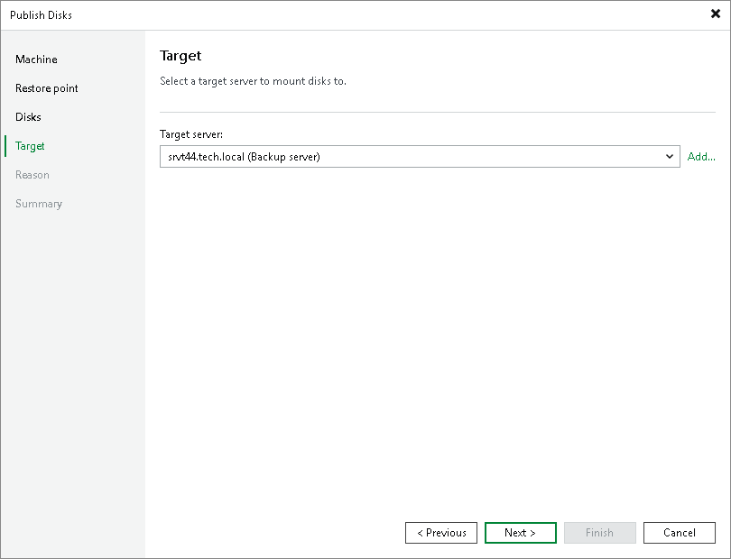

# Publishing Disks

You can publish disks to get the backup contents of one or more disks instead of all disks in a backup.

|  |
| --- |
| Note |
| This section describes only basic steps that you must take to publish disks. To get a detailed description of all settings of the disk publishing process, see the [Publishing Disks](https://helpcenter.veeam.com/docs/vbr/userguide/publishing_disks.html?ver=13) section in the Veeam Backup & Replication User Guide. |

In Veeam Cloud Connect, disk publishing is supported for the following types of backups in cloud repositories.

* Backups of VMware vSphere VMs created by Veeam Backup & Replication

* Backups of Microsoft Hyper-V VMs created by Veeam Backup & Replication

* Backups of Microsoft Windows machines created by Veeam Agent for Microsoft Windows

This operation is not supported for VM replicas and backups of Linux, Mac or Unix machines.

In Veeam Cloud Connect, disk publishing operation for backups in the cloud repository is similar to disk publishing within regular backup repositories. To learn more about disk publishing in the regular Veeam Backup & Replication environment, see the [Disk Publishing (Data Integration API)](https://helpcenter.veeam.com/docs/vbr/userguide/data_integration_api.html?ver=13) section in the Veeam Backup & Replication User Guide.

To publish disks, complete the following steps:

1. Open the Home view.
2. Select the Backups node in the inventory pane. Expand the necessary backup in the working area, select a backup whose disks you want to publish and click Publish Disks on the ribbon.

Alternatively, you can right-click the backup and select Publish disks.

1. At the Restore Point step of the wizard, select the necessary restore point.

1. At the Disks step of the wizard, select check boxes next to the disks that you want to publish.

* For VM backups, you can see Disk name and Size.
* For Veeam Agent backups, Volumes are displayed as well as Disk name and Size.

1. At the Target step of the wizard, select a server to which the disk content will be published. You can select one of the following types of servers:

* A server added to the backup infrastructure.
* A temporary server. In this case, select Specify a different host from the drop-down list. In the Target Server window, specify a server name or IP and credentials to the server.
* The original server if you publish disks from a backup created by Veeam Agent for Microsoft Windows. In this case, select Original server from the drop-down list.

If prompted, specify credentials of the user account to connect to.

1. At the Reason step of the wizard, enter a reason for publishing disks for future reference.

|  |
| --- |
|  Tip |
| If you do not want to show this step of the wizard, select the Do not show me this page again check box. If you further will want to return this page, follow the instructions described in [this Veeam KB article](https://www.veeam.com/kb4432). |

1. At the Summary step of the wizard, review the configured settings and click Finish.

What You Do Next

The disk content will become available in the C:\VeeamFLR\ folder on the target server. For disks of Microsoft Windows machines, the disk content is available in the read-only state. You can perform the necessary operations with the published disk data, for example, find specific documents, copy files or perform antivirus scan of the backed-up data.

When you are finished, you can stop the disk publish session.

For details, see the [Managing Published Disks](https://helpcenter.veeam.com/docs/vbr/userguide/publishing_disks_manage.html?ver=13) section in the Veeam Backup & Replication Guide.

