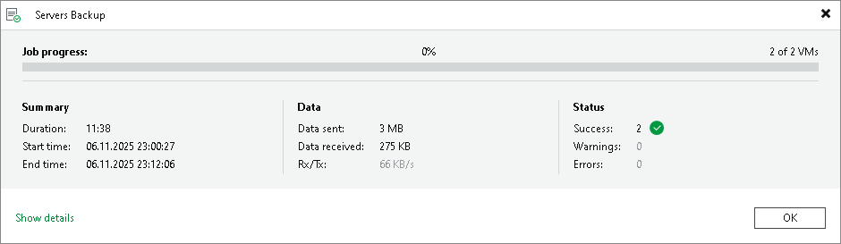
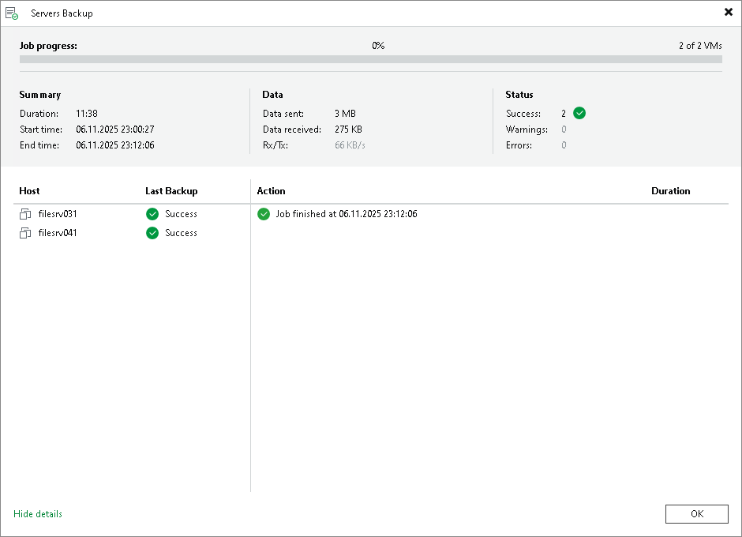
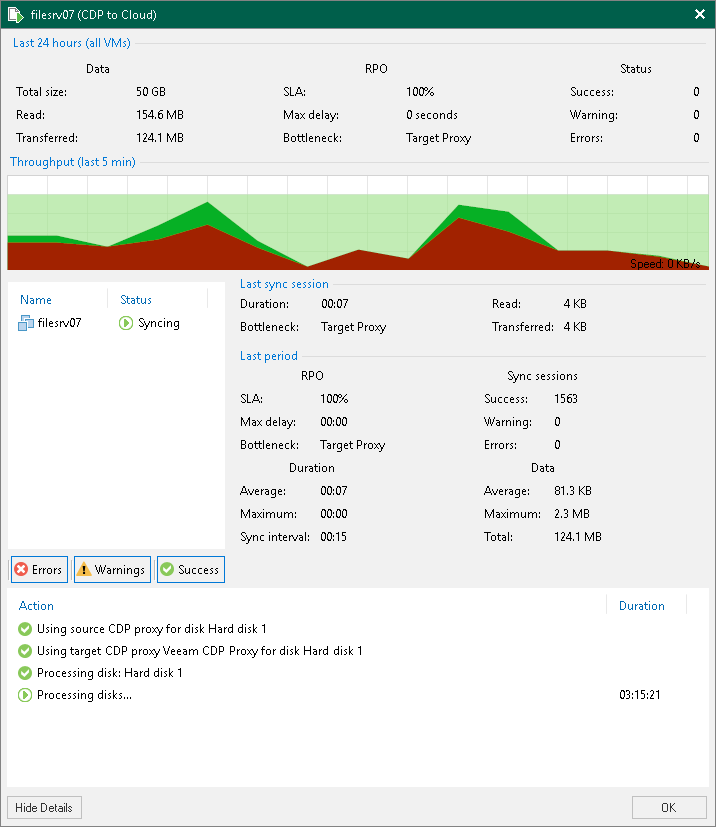

In this article

The SP can view detailed statistics on VM backup job, backup copy job, replication job and CDP policy sessions performed by tenants within last 24 hours.

To view real-time statistics for a job, do one of the following:

* Open the Cloud Connect view, in the inventory pane select Last 24 hours or Running. In the working area, double-click the job.
* Open the Cloud Connect view, in the inventory pane select Last 24 hours or Running. In the working area, right-click the job and select Statistics.
* Open the Cloud Connect view, in the inventory pane select Last 24 hours or Running. In the working area, select the job and click Statistics on the ribbon.

|  |
| --- |
| Note |
| The Statistics option is unavailable for Veeam Agent backup jobs. To learn more, see [Veeam Agent Backup Job Statistics](cc_report_jobs.md#agent_stats). |

The real-time statistics provides detailed data on job sessions: duration, start and end time, amount of sent and received data and details of the session performance, for example, warnings and errors that have occurred in the process of operation.

In addition to overall job statistics, the real-time statistics provides information on each object processed with the job. To view the processing progress for a specific object, select it in the list on the left.

|  |
| --- |
| Tip |
| To collapse and expand the real-time statistics window, use Hide Details and Show Details buttons at the bottom left corner of the window. |

Statistics Counters

Veeam Backup & Replication displays jobs statistics for the following counters:

* At the top of the window, Veeam Backup & Replication displays the number of VMs in the job and the number of processed VMs.
* The Summary box shows general information about the job:

+ Duration — time from the job start till the current moment or job end.
+ Start time — time of the job start.
+ End time — time of the job end.

* The Data box shows information about processed VM data:

+ Data sent — amount of data sent from the SP side to the tenant side.
+ Data received — amount of data transferred from the tenant side to the SP side.
+ Rx/Tx — data transfer speed (displayed for currently running jobs only).

* The Status box shows information about the job results. This box informs how many tasks have completed with the Success, Warning and Error statuses (1 task per 1 VM).
* The pane at the lower left corner shows a list of objects included in the job. For tenant jobs, Veeam Backup & Replication displays the list according to the following rules:

* The tenant selected the Allow this Veeam Backup & Replication installation to be managed by the service provider check box at the Service Provider step of the Service Provider wizard when connecting to the SP. In this case, Veeam Backup & Replication displays in the list names of objects included in the job.
* The tenant did not select the Allow this Veeam Backup & Replication installation to be managed by the service provider check box at the Service Provider step of the Service Provider wizard when connecting to the SP. In this case, Veeam Backup & Replication does not display names of objects included in the job. Instead, it displays identifiers for the objects that Veeam Backup & Replication saves in the configuration database.

* The pane at the lower right corner shows a list of operations performed during the job. To see a list of operations for a specific object included in the job, click the object in the pane on the left. To see a list of operations for the whole job, click anywhere on the blank area in the left pane.

Statistics Counters for CDP Policy Sessions

The SP can view detailed statistics on CDP policy sessions performed by tenants within last 24 hours. Veeam Backup & Replication displays session statistics for the following counters:

* The Data box shows general information about the job:

+ Total size — total size of the processed data.
+ Read — amount of data read from the datastore prior to applying compression and deduplication. The value of this counter is typically lower than the value of the Total size counter. Veeam Backup & Replication reads only data blocks that have changed since the last policy session, processes and copies these data blocks to the target.
+ Transferred — amount of data transferred from the source CDP proxy to the target CDP proxy. The data is transferred after compression and deduplication.

* The RPO box shows information about processed VM data:

+ SLA — percentage of sessions completed within the desired RPO.
+ Max delay — difference between the configured RPO and time required to transfer and save data.
+ Bottleneck — bottleneck in the data transmission process.

* The Status box shows information about the job results. This box informs how many tasks have completed with the Success, Warning and Error statuses.

Page updated 11/18/2025

Page content applies to build 13.0.1.1071
