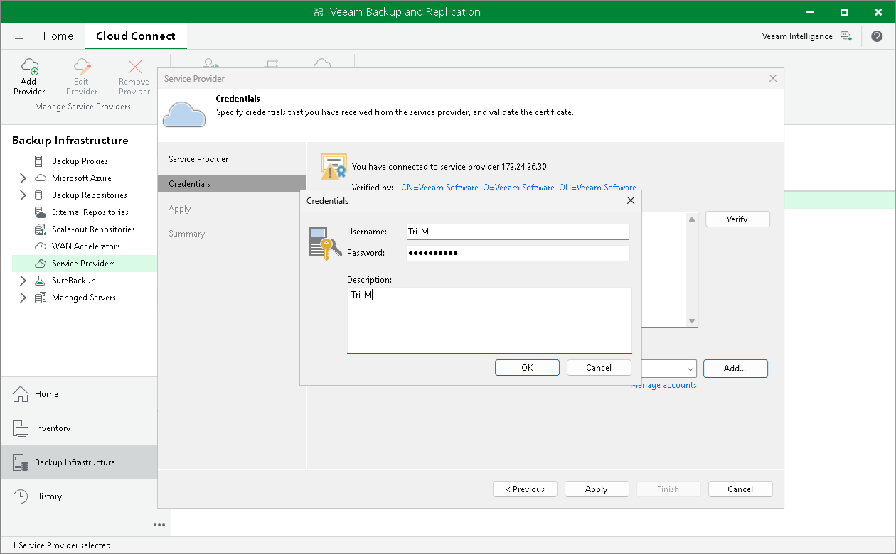

In this article

The SP can rename a tenant account, for example, if the SP wants to change the user name to a more friendly one.

When the SP renames a tenant account, it is not enough to simply change the user name in the tenant account properties. The SP must also rename the folder with tenant backups on the cloud repository and make sure that the tenant reconnects to the SP under the new name. In this case, Veeam Backup & Replication will be able to save backups to the backup chain that already exists on the cloud backup repository, and the tenant will be able to restore data from previously created backups.

To rename a tenant account (performed by the SP on the SP Veeam backup server):

1. Open the Cloud Connect view.
2. In the inventory pane, click Tenants.
3. In the working area, right-click the necessary tenant and select Properties.
4. At the Tenant step of the Edit Tenant wizard, specify a new name in the Username field.
5. Click Finish to save the changes.
6. [For Veeam Cloud Connect Backup] On the cloud repository, rename a subfolder where tenant backups are stored. For example, if the tenant was named Tenant1, and you changed the user name to Tenant2, you must find the Tenant1 subfolder on the cloud repository and rename it to Tenant2.

|  |
| --- |
| Note |
| For object storage repositories, renaming of the subfolder with tenant backups is not supported. In case the SP provides the tenant with an object storage repository as a cloud repository, after the SP renames the tenant account, tenant backup jobs will create a full backup in the cloud repository. |

1. Inform the tenant about the user name change and make sure that the tenant reconnects to the SP under this name.

To reconnect to the SP (performed by the tenant on the tenant Veeam backup server):

1. Open the Backup Infrastructure view.
2. In the inventory pane, click the Service Providers node.
3. In the working area, right-click the SP and select Properties.
4. At the Credentials step of the wizard, click Add next to the Credentials field and specify a new user name and password to connect to the SP. You must specify the password that you used before, unless the SP has changed the password together with the user name.
5. Follow the next steps of the wizard without changing default settings. At the Summary step of the wizard, click Finish.

|  |
| --- |
| Important |
| The tenant must reconnect to the SP only after the SP renames the subfolder with tenant backups on the cloud repository. In the opposite case, tenant backup job sessions will be failing. |

Page updated 4/17/2024

Page content applies to build 13.0.1.1071
