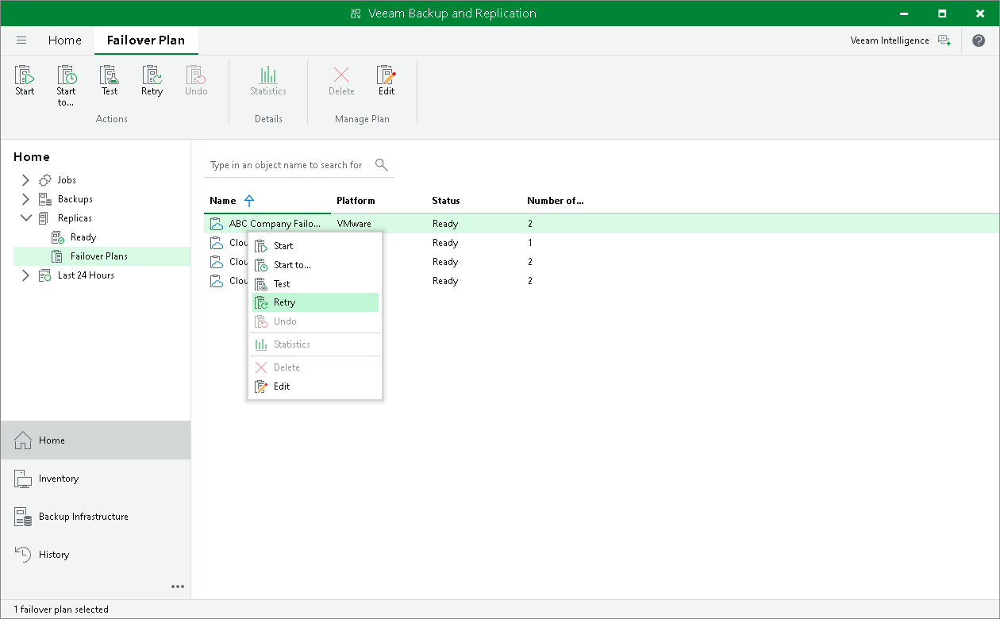

In this article

You can retry a cloud failover plan if one or several VMs fail to failover properly. Veeam Backup & Replication retries the failover operation only for those VMs that do not succeed to failover to their replicas on the cloud host.

To retry a cloud failover plan:

1. Open the Home view.
2. In the inventory pane, expand the Replicas node and click Failover Plans.
3. In the working area, right-click the necessary cloud failover plan and select Retry.

Page updated 4/17/2024

Page content applies to build 13.0.1.1071
