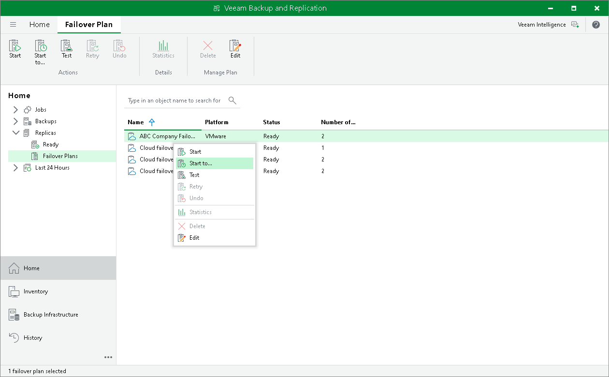

In this article

With a cloud failover plan, you can perform full site failover at any time. During full site failover, tenant VMs fail over to their replicas on the cloud host one by one, as a group. You can fail over to the most recent VM state or select the necessary restore point for VMs in the cloud failover plan.

To fail over to the VM replicas latest restore point:

1. Open the Home view.
2. In the inventory pane, expand the Replicas node and click Failover Plans.
3. In the working area, right-click the necessary cloud failover plan and select Start.

To fail over to a certain restore point:

1. Open the Home view.
2. In the inventory pane, expand the Replicas node and click Failover Plans.
3. In the working area, right-click the necessary cloud failover plan and select Start to.
4. In the Choose Restore Point window, select the backup date and time. Veeam Backup & Replication will find the closest restore point prior to the entered value for each VM and fail over to it.

Page updated 4/17/2024

Page content applies to build 13.0.1.1071
