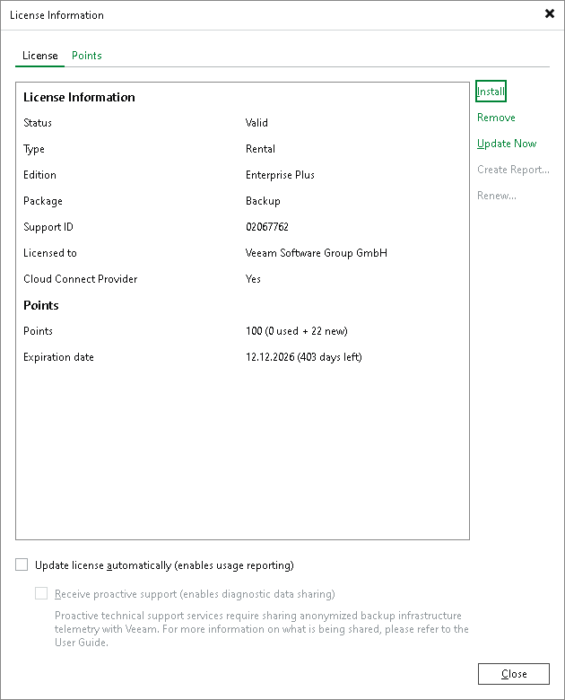

In this article

When you install Veeam Backup & Replication on the SP side, you must specify a path to the Veeam Cloud Connect license file (LIC) that you have obtained from Veeam. If the SP manages tenant workloads, you also need to install Veeam Backup & Replication on the tenant side and specify a path to the Rental Veeam Backup & Replication license file. You can skip this step and install the license when the product is set up.

To view information about the currently installed license, select License from the main menu of the Veeam Backup & Replication console.

To install a new license or change the license:

1. From the main menu, select License.
2. In the License Information window, in the License tab, click Install and specify a path to the license file.

Page updated 11/9/2023

Page content applies to build 13.0.1.1071
