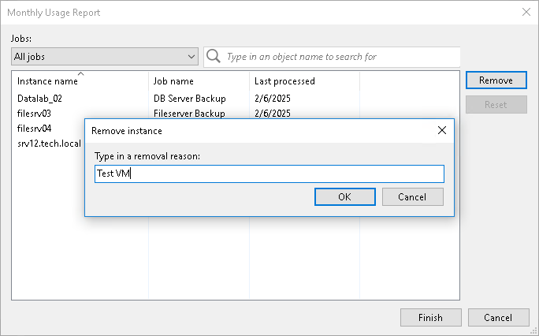

In this article

You can remove specific managed VMs from a license usage report for the Rental Veeam Backup & Replication license. When you remove a VM from the report, you can also remove this VM from all jobs to which this VM is added. For every VM removal, you must specify a reason.

To adjust a report:

1. Open the Monthly Usage Report window:

* [For automatic reporting] In the notification window informing that the report is generated, click Review.
* [For manual reporting] In the notification window informing that the report is generated, click Review Now.

1. In the Monthly Usage Report window, click Adjust.
2. In the list of VMs, select the VM that you want to remove from the report and click Remove.

By default, the list of VMs contains all managed VMs included in the report. To quickly find the necessary VM, you can use the search field at the top of the window. You can also select a job from the drop-down list in the Jobs field to view a list of VMs added to a specific job.

1. In the displayed window, in the Type in a removal reason field, provide a reason for removing the VM from the report.
2. Click OK, then click Finish. The change will be reflected in the report.

|  |
| --- |
| Tip |
| To reset changes introduced in the report, in the report adjustment window, click Reset. |

Page updated 11/19/2025

Page content applies to build 13.0.1.1071
