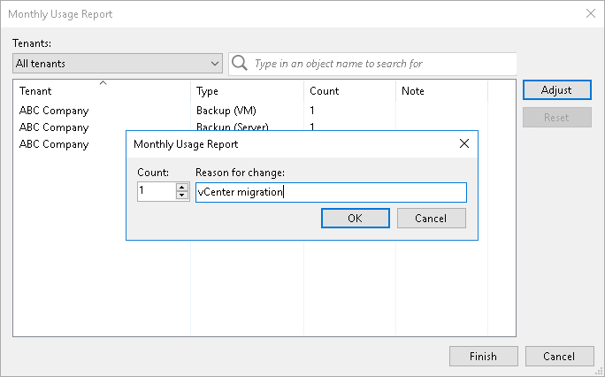

In this article

You can reduce the number of VMs in a license usage report for the Veeam Cloud Connect license. You can adjust the number of backed-up and replicated VMs individually for every tenant. For every change in the report, you must specify a reason.

|  |
| --- |
| Note |
| In the monthly usage report, you cannot change the number of workstations and servers for which tenants have created Veeam Agent backups in the cloud repository. |

To adjust a report:

1. Open the Monthly Usage Report window:

* [For automatic reporting] In the notification window informing that the report is generated, click Review.
* [For manual reporting] In the notification window informing that the report is generated, click Review Now.

1. In the Monthly Usage Report window, click Adjust.
2. In the list of tenants, select the tenant for which you want to change the number of VMs and click Adjust.

By default, the list of tenants contains names of all tenant accounts whose VMs are included in the report. To quickly find the necessary tenant, you can use the search field at the top of the window. You can also select the tenant account from the drop-down list in the Tenants field.

1. In the displayed window, in the Count field, change the number of reported VMs.
2. In the Reason for change field, provide a reason for adjusting the number of reported VMs.
3. Click OK, then click Finish. The change will be reflected in the report.

|  |
| --- |
| Tip |
| To reset changes introduced in the report, in the report adjustment window, click Reset. |

Page updated 1/30/2024

Page content applies to build 13.0.1.1071
