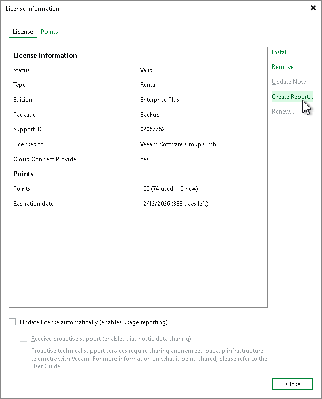

# Generating License Usage Report

The SP can manually generate a license usage report. In contrast to periodic license usage reports that reflect license usage for the previous calendar month, the manually generated report reflects license usage for the last 31 days prior to the time when the report was generated. The report helps the SP monitor current license usage: the SP can generate a report on a specific day of the month, compare the current report with the previous monthly report and predict license usage that will be reflected in the next monthly report.

The report displays information about current license usage in the similar way as the monthly usage report. The report contains the following data:

* License information: Veeam Backup & Replication edition, license expiration date, name of the company to which the license was issued and support ID.
* The number of instances used by each type of protected workloads (backed-up and replicated VMs, workstations and servers) and the total number of used instances.
* For each type of protected workloads, the report displays the number of instances used by each tenant.
* For each type of protected workloads, the report also displays the number of new objects that are not included in the report.

The SP cannot submit a manually generated license usage report to Veeam. This report is intended for monitoring purposes only.

To generate a license usage report:

1. From the main menu, select License.
2. In the License Information window, in the License tab, click Create Report.

