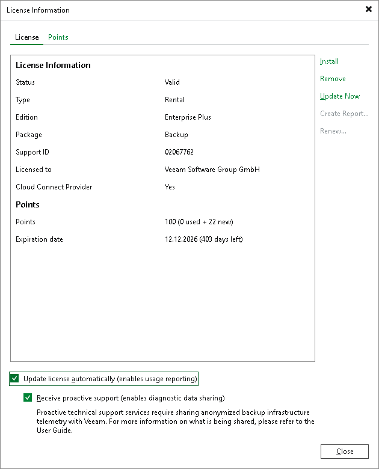

In this article

Veeam Cloud Connect license and Rental Veeam Backup & Replication license support automatic license update. Instead of installing the license file manually after updates to the license, you can instruct Veeam Backup & Replication to communicate with the Veeam licensing server, download the license file from it and install the new license on the Veeam backup server.

|  |
| --- |
| Important |
| Enabling license auto update activates [Automatic License Usage Reporting](sp_license_usage_report_online.md). You cannot use license auto update without automatic usage reporting. |

The new license key differs from the previously installed license key in the license expiration date and support expiration date. If you obtain a license for a new (for example, greater) number of points, the Points counter in the new license also displays the new number of licensed points.

To learn more about the automatic license update process, see the [Updating License Automatically](https://helpcenter.veeam.com/docs/vbr/userguide/license_autoupdate.html?ver=13) section in the Veeam Backup & Replication User Guide.

By default, the automatic license update feature is deactivated. To enable it, do the following:

1. From the main menu, select License.
2. In the License Information window, in the License tab, select the Update license automatically check box.

|  |
| --- |
| Tip |
| If you do not want to enable automatic license update, after you obtain a new license, you can click the Update Now button to update the license manually. |

Page updated 11/11/2025

Page content applies to build 13.0.1.1071
