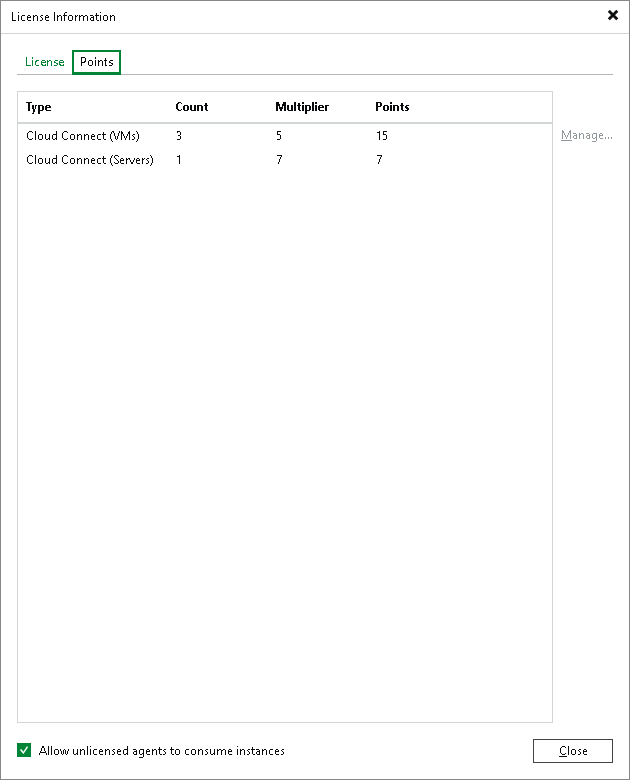

# Viewing License Information

You can view information about protected tenant workloads in the License Information window.

To view license information:

1. From the main menu, select License.
2. In the License Information window, click the Points tab.
3. View information about protected tenant workloads. Veeam Backup & Replication displays information about workloads of the following types:

* Cloud Connect (VMs) — VMs backed up to a cloud repository by backup jobs configured in Veeam Backup & Replication.
* Cloud Connect (Replicas) — VMs replicated to a cloud host by replication jobs configured in Veeam Backup & Replication.
* Cloud Connect (Workstations) — physical or virtual workstations backed up to a cloud repository by Veeam Agent backup jobs configured Veeam Agent or Veeam Backup & Replication.
* Cloud Connect (Servers) — physical or virtual servers backed up to a cloud repository by Veeam Agent backup jobs configured in Veeam Agent or Veeam Backup & Replication.

