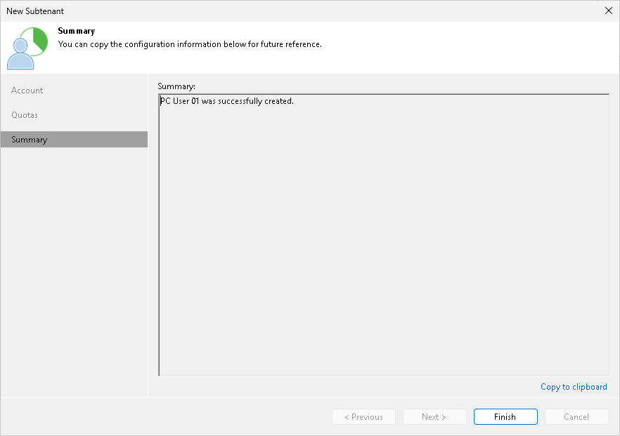

# Step 4. Finish Working with Wizard

At the Summary step of the wizard, complete the procedure of subtenant account registration.

1. Click the Copy to clipboard link to copy information about the created subtenant account: user name, password, cloud repository and quota. You must send the copied information to a user on the tenant side so that they can use the created subtenant account to configure a backup job targeted at the cloud repository.
2. Click Finish to exit the wizard.

