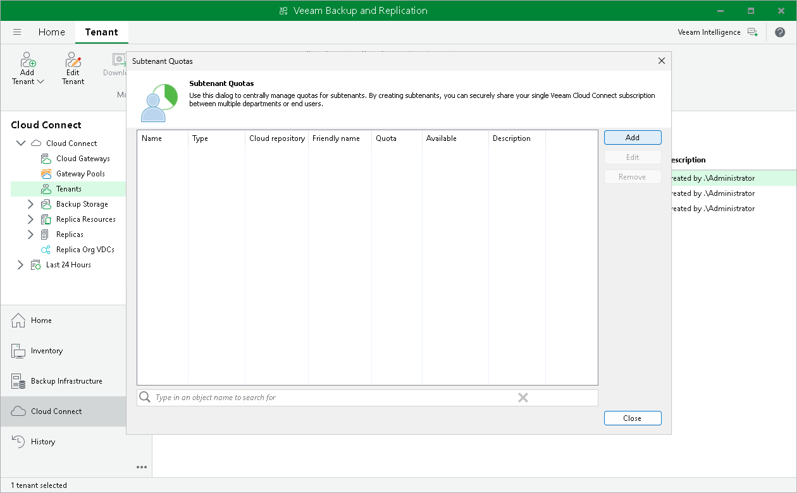

In this article

To launch the New Subtenant wizard:

1. Open the Cloud Connect view.
2. In the inventory pane, click the Tenants node.
3. In the working area, select the necessary tenant and click Manage Subtenants on the ribbon or right-click the tenant and select Manage subtenants.
4. In the Subtenant Quotas window, click Add.

Page updated 5/22/2024

Page content applies to build 13.0.1.1071
