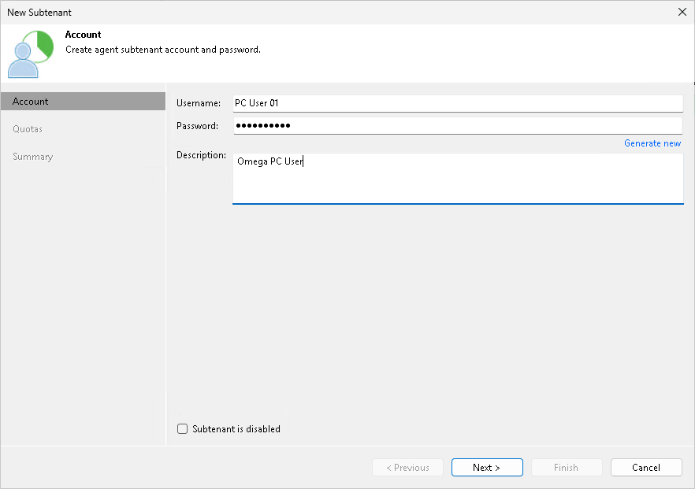

# Step 2. Specify Subtenant Settings

At the Account step of the wizard, specify settings for the created subtenant account:

1. In the Username field, specify a name for the created subtenant account. The user name must meet the following requirements:

* The maximum length of the user name is 128 characters. It is recommended that you create short user names to avoid problems with long paths to backup files on the cloud repository.
* The user name may contain space characters.
* The user name must not contain the following characters: ,\/:\*?\"<>|=;@ as well as Unicode characters.
* The user name must not end with the period character [.].

1. In the Password field, provide the password for the subtenant account. You can enter your own password or click the Generate new link at the bottom of the field. In the latter case, Veeam Backup & Replication will generate a safe password. To get a copy the generated password, click the Copy to clipboard link at the bottom of the window.
2. In the Description field, specify a description for the created subtenant account.
3. If you want the subtenant account to be created in the disabled state, select the Subtenant is disabled check box. In this case, Veeam Backup & Replication will create the subtenant account, but the subtenant will not be able to connect to the SP and create backups on the cloud repository.

