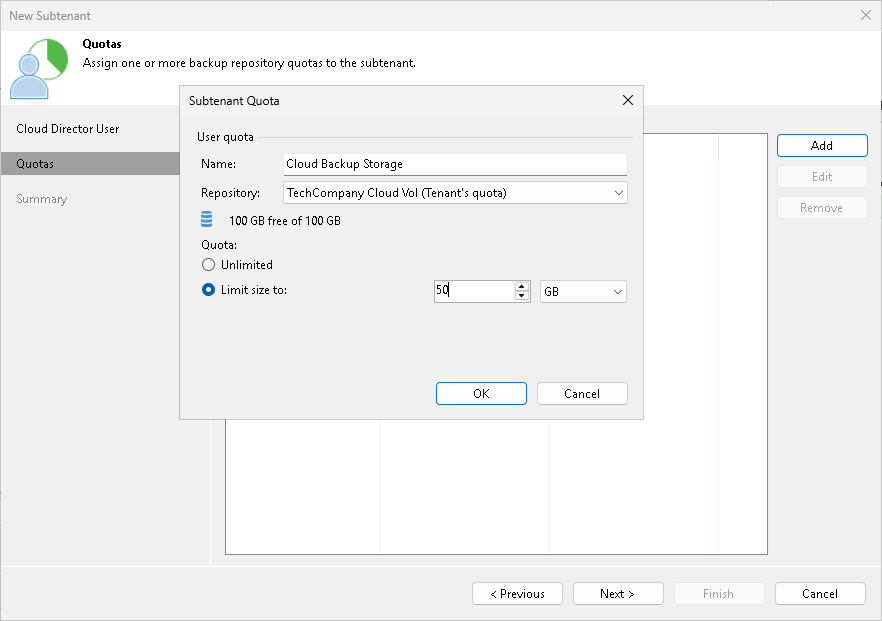

# Step 3. Allocate Subtenant Quota

At the Quotas step of the wizard, specify subtenant quota settings for the created account. You can assign to the subtenant tenant a single quota on a cloud repository assigned to the tenant account.

To assign a subtenant quota:

1. Click Add on the right of the Available user quotas list.
2. In the Subtenant Quota window, in the Name field, enter a friendly name for the subtenant quota. The name you enter will be displayed at the subtenant side.
3. In the Repository field, select a cloud repository whose space resources must be allocated to the subtenant.
4. By default, Veeam Backup & Replication allows subtenants to use an entire quota on the cloud repository assigned to the tenant. If you want to limit the amount of storage space that the subtenant can use on the cloud repository, in the Quota section, select Limit size to and specify the necessary subtenant quota.

When you consider limiting the subtenant quota, remember to allocate the sufficient amount of storage space for the subtenant. The subtenant quota must comprise the amount of disk space used to store a chain of backup files plus additional space required for performing the backup chain transform operation. Generally, to perform the transform operation, Veeam Backup & Replication requires the amount of disk space equal to the size of a full backup file.

1. Click OK.

