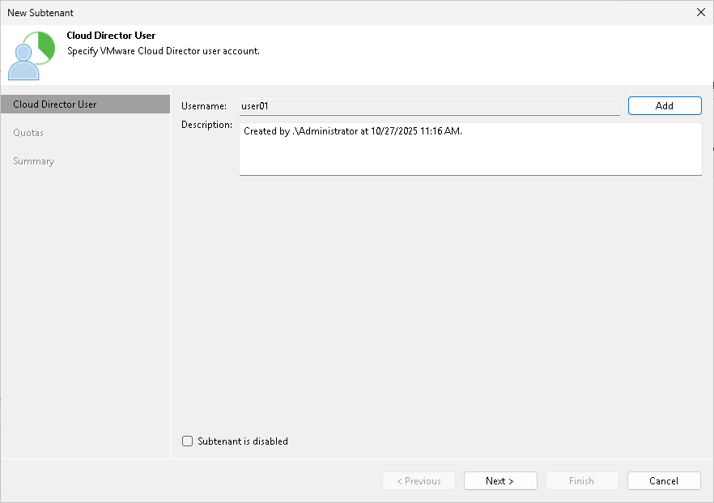

# Step 2. Select Cloud Director User

At the Cloud Director User step of the wizard, specify settings for the created subtenant account:

1. Click Add next to the Username field and select a user account of a VMware Cloud Director organization to which you want to allocate a quota on the cloud repository. The user account must be created in advance by the SP in VMware Cloud Director.
2. In the Description field, specify a description for the created subtenant account.
3. If you want the subtenant account to be created in the disabled state, select the Subtenant is disabled check box. In this case, Veeam Backup & Replication will create the subtenant account, but the subtenant will not be able to connect to the SP and create backups on the cloud repository.

