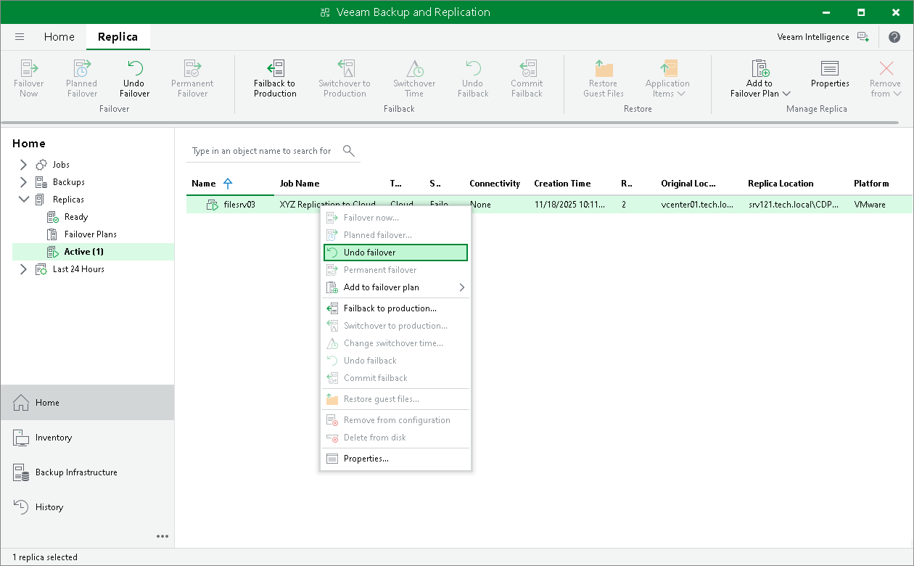

In this article

To switch back to a production VM and revert a VM replica on the cloud host to its pre-failover state, you can undo partial site failover. When you undo the failover operation, Veeam Backup & Replication powers off a running VM replica on the cloud host and rolls back to initial state of a VM replica.

To undo partial site failover, do either of the following:

* Open the Home view and select the Replicas node. In the working area, select the necessary VM and click Undo Failover on the ribbon.
* Open the Home view and select the Replicas node. In the working area, right-click the necessary VM and select Undo failover.
* Open the Home view and select Active under the Replicas node. In the working area, select the necessary replica and click Undo Failover on the ribbon or right-click the replica and select Undo failover.

In the displayed dialog box, click Yes to confirm the operation.

Page updated 11/9/2023

Page content applies to build 13.0.1.1071
