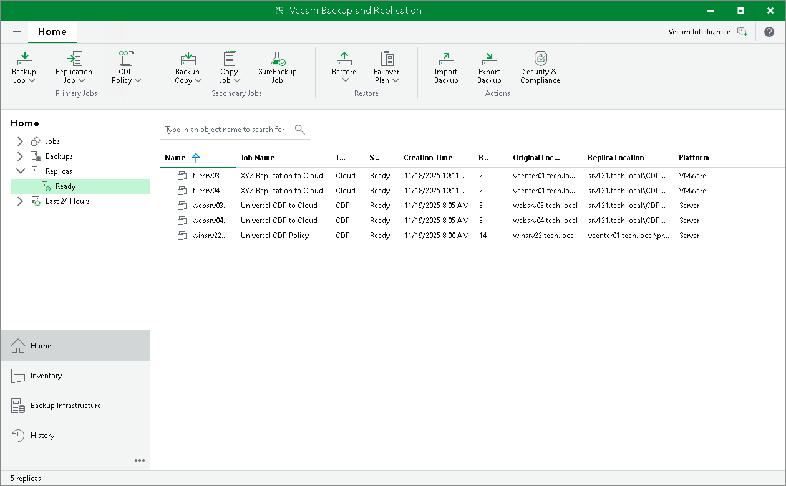

In this article

After you have set up the Veeam Cloud Connect infrastructure, you can proceed to performing data protection and disaster recovery tasks using the cloud host provided to you by the SP.

You can perform the following tasks targeted at the cloud host:

* [Create a replication job](creating_replication_jobs.md)

* [Create a CDP policy for VMware vSphere](creating_cdp_policies.md)
* [Create a universal CDP policy](creating_universal_cdp_policies.md)

* Perform failover:

+ [Full site failover](performing_full_site_failover.md)
+ [Partial site failover](performing_partial_failover.md)

* [Perform failback](performing_failback_to_production.md)
* Perform data restore:

+ [VM guest OS files restore](cloud_replica_guest_restore.md) (Microsoft Windows file system only. Multi-OS restore is not supported.)

This operation is supported for both snapshot-based replicas and CDP replicas. In previous versions of Veeam Backup & Replication, this operation was supported only for snapshot-based replicas.

+ [Application items restore](cloud_replica_app_restore.md)

This operation is supported for snapshot-based replicas only.

VM replicas created on the cloud host are displayed under the Replicas node in the inventory pane of the Home view along with regular VM replicas. To identify the replica type, consider the following:

* For snapshot-based replicas registered on the cloud host, Veeam Backup & Replication displays the Cloud value in the Type column of the working area.
* For CDP replicas registered on the cloud host, Veeam Backup & Replication displays the CDP value in the Type column of the working area.

Related Topics

* [Veeam Cloud Connect Replication](cloud_replication.md)
* [Continuous Data Protection (CDP) with Veeam Cloud Connect](cloud_connect_cdp.md)
* [VMware Cloud Director Support](cloud_vcloud_director.md)

Page updated 11/18/2025

Page content applies to build 13.0.1.1071
