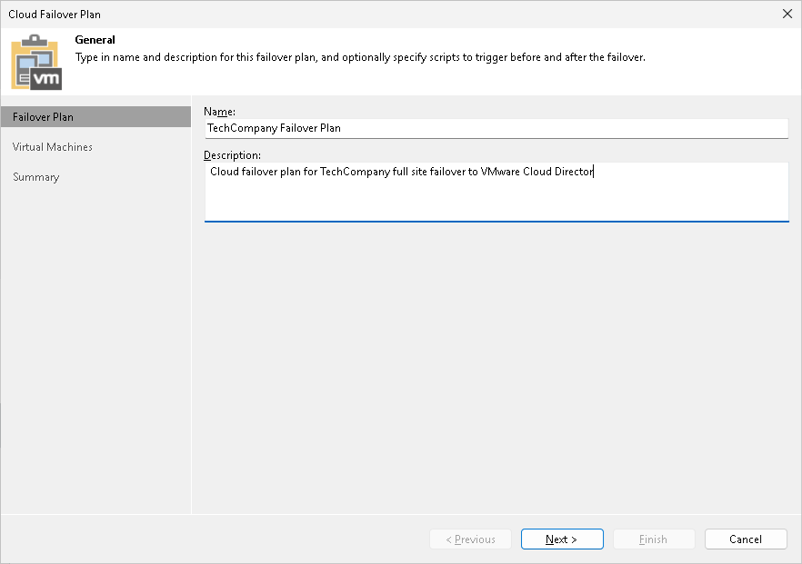

# Step 2. Specify Failover Plan Name and Description

At the Failover Plan step of the wizard, specify a name and description for the cloud failover plan.

1. In the Name field, enter a name for the cloud failover plan.
2. In the Description field, provide a description for future reference. The default description contains information about the user who created a failover plan, date and time when the plan was created.

