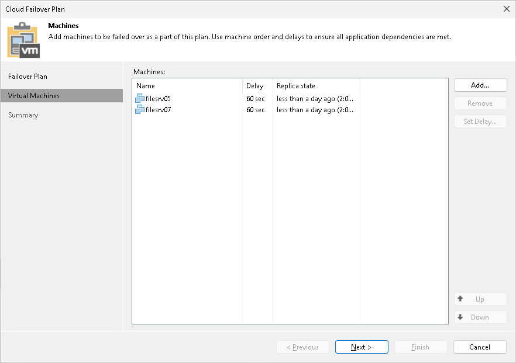

In this article

At the Virtual Machines step of the wizard, select VMs that you want to add to the cloud failover plan. You can add to a cloud failover plan separate VMs for which a replication job created at least one restore point on a cloud host.

To add VMs:

1. Click Add VM.
2. Browse existing replication jobs targeted at the cloud host and select all VMs or specific VMs from replication jobs.

To quickly find VMs, you can use the search field at the bottom of the Select Replica window. Enter a VM name or a part of it in the search field and click Start search or press [ENTER].

1. [Optional] If you want to set a time delay for VM start during failover, select the VM, click Set Delay and specify the necessary delay in the Boot Delay window. This option may be helpful if you want to make sure that some VMs are already running at the moment dependent VMs start. If you do not specify the time delay, VMs will be started simultaneously.

Page updated 1/25/2024

Page content applies to build 13.0.1.1071
