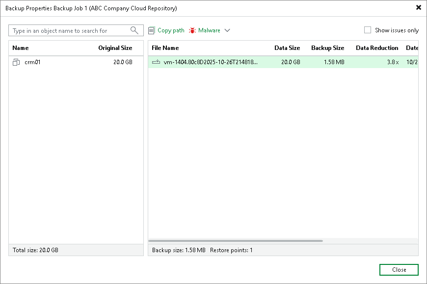
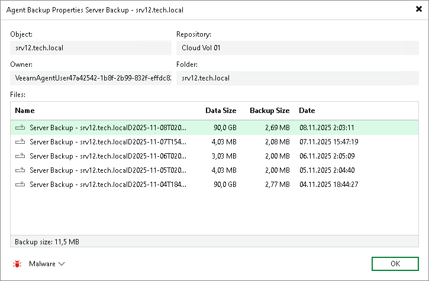

In this article

You can view summary information about created backups. The summary information provides the following data: available restore points, date of restore points creation, data size and backup size. For VM backups and backups created by Veeam Agent in the managed mode, Veeam Backup & Replication also displays compression and deduplication ratios.

|  |
| --- |
| Note |
| If you enabled data encryption in the backup job settings, and the size of backup files in the Backup Size column is larger than the size of the original data in the Original Size column, this can mean that your SP configured the cloud repository using Dell Data Domain. Contact the SP, ask him to check the repository settings and clear the Decompress backup data blocks before storing check box. |

To view summary information for backups:

1. Open the Home view.
2. In the inventory pane, click Cloud under the Backups node.
3. Do either of the following:

* To view summary information for a VM backup, in the working area, right-click the necessary backup job and select Properties.
* To view summary information for an entire backup related to a Veeam Agent backup job configured in Veeam Backup & Replication (parent backup), in the working area, right-click the necessary backup job and select Properties.
* To view summary information for a backup related to a specific machine in a Veeam Agent backup job configured in Veeam Backup & Replication (child backup), in the working area, expand the necessary backup job, right-click the machine and select Properties.
* To view summary information for a backup created by Veeam Agent operating in the standalone mode, in the working area, right-click the necessary backup under the Agents node and select Properties.

For VM backups and parent backups created by Veeam Agent in the managed mode, summary information looks in the following way:

For backups created by Veeam Agent in the standalone mode and child backups created by Veeam Agent in the managed mode, summary information looks in the following way:

Page updated 4/17/2024

Page content applies to build 13.0.1.1071
