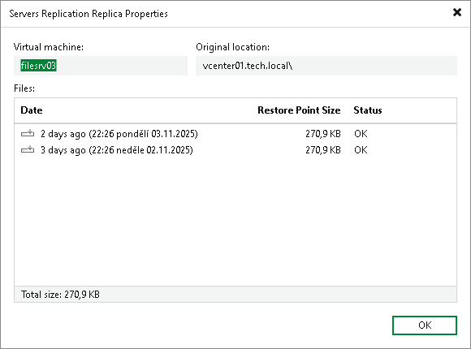

# Viewing Properties

You can view summary information about created tenant VM replicas. The summary information provides the following data: available restore points, date of restore points creation, data size, restore point size and replica status.

To view summary information for replicas:

1. Open the Cloud Connect view.
2. In the inventory pane, click Replicas.
3. In the working area, right-click the necessary VM replica and select Properties.

