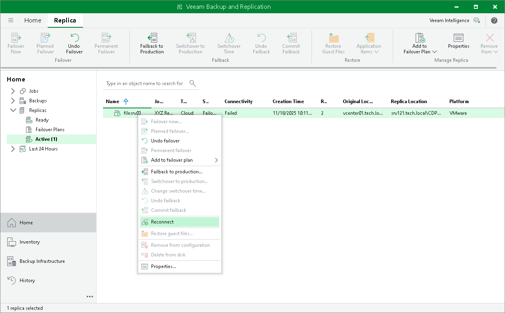

# Re-establishing VPN Tunnel

When you perform partial site failover, production VMs and VM replicas on the cloud host communicate through the secure VPN tunnel that is set between the pair of network extension appliances. You can monitor the VPN connection state and re-establish the VPN tunnel in case the VPN connection breaks.

To view the VPN connection state:

1. Open the Home view.
2. In the inventory pane, click the Replicas node. VPN connection state will be displayed in the Connectivity column of the working area.

To re-establish a VPN tunnel:

1. Open the Home view.
2. In the inventory pane, click the Replicas node.
3. In the working area, right-click the necessary VM replica in the Failed connectivity state and select Reconnect. Veeam Backup & Replication will restart the VPN daemon on the network extension appliances that are used for connecting production VMs and VM replicas on the cloud host.

