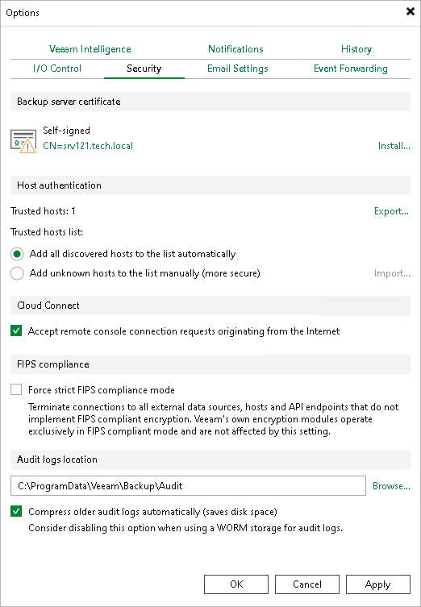

# Cloud Connect Remote Access Console

In this article

If you use the Veeam Cloud Connect functionality, you can remotely access the tenant backup server to manage Veeam Backup & Replication deployed on the tenant side. One of the ways to do this is to use the Remote Access Console. In case it is installed on a remote machine connected to an external network, you will need to enable access to the cloud gateway for the Remote Access Console over the internet. For more information, see [Veeam Cloud Connect Guide](https://helpcenter.veeam.com/docs/vbr/cloud/cc_remote_access.html?ver=13).

To enable access to the cloud gateway for the Remote Access Console:

1. From the main menu, select Options.
2. Open the Security tab.
3. In the Cloud Connect section, select the Accept remote console connection requests originating from the Internet check box.
4. Click OK.

Page updated 5/24/2024

Page content applies to build 13.0.1.1071
