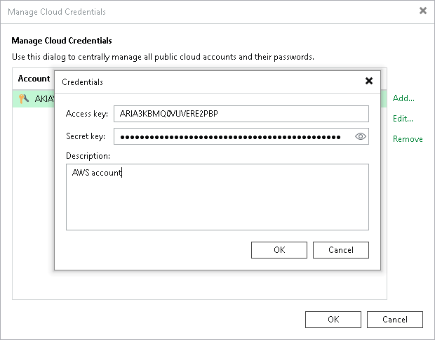

# Access Keys for AWS Users

You can create a record for credentials that you plan to use to connect to AWS.

To access AWS resources, you can use Identity and Access Management (IAM) user credentials or AWS account root user credentials. However, AWS recommends that you use the IAM user credentials. For details, see the [AWS Account Root User Credentials vs. IAM User Credentials](https://docs.aws.amazon.com/general/latest/gr/root-vs-iam.html) section in the AWS General Reference. The permissions that you must provide to the user are listed in section [Permissions](required_permissions.md#rpasos).

Since Veeam Backup & Replication uses AWS CLI commands to perform operations in AWS, instead of a user name and password you must specify an AWS access key. AWS access keys are long-term user credentials that consists of two parts: an access key ID and a secret access key. For details, see the [Managing Access Keys for IAM Users](https://docs.aws.amazon.com/IAM/latest/UserGuide/id_credentials_access-keys.html) section in the AWS IAM User Guide.

To create a credentials record:

1. From the main menu, select Credentials and Passwords > Cloud Credentials.
2. Click Add > AWS access key.
3. In the Access key field, enter an access key ID.
4. In the Secret key field, enter a secret access key. To view the entered secret key, click and hold the eye icon on the right of the field.
5. In the Description field, enter a description for the created credentials record.

|  |
| --- |
| Important |
| It is recommended that the user whose credentials you plan to use to connect to AWS S3 has administrative permissions — access to all AWS S3 actions and resources. |

Related Topics

* [External Repositories](external_repository.md)
* [Object Storage Repositories](object_storage_repository.md)
* [Restore to Amazon EC2](restore_amazon.md)

