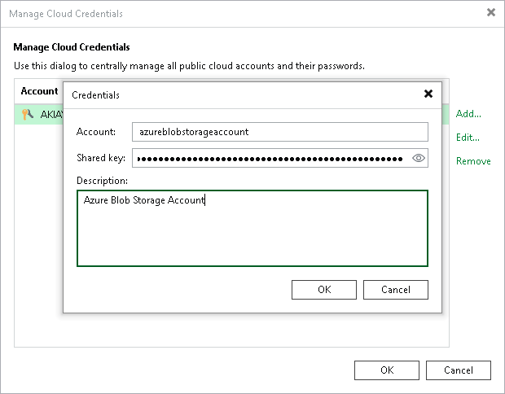

# Microsoft Azure Storage Accounts (Shared Key)

You can create a credentials record for a Microsoft Azure storage account to connect to the following types of accounts:

* Azure Blob storage added as an [object storage repository](osr_adding_blob_storage.md), a [performance extent](backup_repository_sobr_extents.md) or [capacity extent](capacity_tier.md) of a scale-out backup repository. Use this option to store data on Azure Blob storage.
* Azure Archive storage added as an [archive extent](new_archive_tier.md) of a scale-out backup repository. Use this option to store data on Azure Blob storage.
* Azure Blob storage added as an [external repository](external_azure_blob_add.md). Use this option to copy, import and restore backups created by Veeam Backup for Microsoft Azure from external to on-premises repositories.
* Microsoft Azure Blob storage [added as a source of unstructured data](os_azure_add.md). Use this option to backups data located on Azure Blob storage repository and restore backed-up data.
* Veeam Data Cloud Vault added as an [object storage repository](osr_adding_blob_storage.md), a [performance extent](backup_repository_sobr_extents.md) or [capacity extent](capacity_tier.md) of a scale-out backup repository. Use this option to store data on Veeam Data Cloud Vault.

Storage Accounts Supported Types

The following types of storage accounts are supported.

| Storage account type | Supported services | Supported performance tiers | Supported access tiers |
| --- | --- | --- | --- |
| General-purpose V2 | Blob (block blobs only) | Standard | The following Azure Storage access tiers are supported:   * Hot: to store data that you access frequently. Supported in [Azure Blob Storage](osr_adding_blob_storage.md) added as an object storage repository. * Cool: to store data that you access infrequently. Supported in [Azure Blob Storage](osr_adding_blob_storage.md) added as an object storage repository. * Cold: to store data that you access infrequently.  Supported in [Azure Archive Storage](osr_adding_blob_storage_archive_tier.md) added as an object storage repository. * Archive: to store data that you access rarely. Supported in [Azure Archive Storage](osr_adding_blob_storage_archive_tier.md) added as an object storage repository.   Consider the following:   * For Azure Blob storage Veeam Backup & Replication will use the access tier that you specified at the [Container](azure_storage_details.md) step of the New Object Storage wizard. * For Azure Archive storage Veeam Backup & Replication will use the access tier that you specified at the [Container](azure_archive_tier_storage_details.md) step of the New Object Storage wizard. |
| BlobStorage |
| BlockBlobStorage | Blob (block blobs only) | Premium | N/A |

For more information about the types of storage accounts in Azure, see [Microsoft Docs](https://docs.microsoft.com/en-us/azure/storage/common/storage-account-overview).

|  |
| --- |
| Important |
| Microsoft Azure Blob storage accounts with the hierarchical namespace are not supported. |

Adding Microsoft Azure Storage Account

To create a record for a Microsoft Azure storage account:

1. From the main menu, select Credentials and Passwords > Cloud Credentials.
2. Click Add > Microsoft Azure storage account.
3. In the Account field, enter the storage account name.
4. In the Shared key field, enter the storage account shared key. To view the entered key, click and hold the eye icon on the right of the field.

|  |
| --- |
| Note |
| The Allow storage account key access option for Shared Key authorization must be enabled in the storage account. For more information on how to find this option, see [Microsoft Docs](https://docs.microsoft.com/en-us/azure/storage/common/shared-key-authorization-prevent?tabs=portal#remediate-authorization-via-shared-key). |

1. In the Description field, enter an optional description for the credentials record.

|  |
| --- |
| Tip |
| If you do not have a Microsoft Azure storage account, you can create it in the Azure portal, as described in the [Azure Storage Documentation](https://docs.microsoft.com/en-us/azure/storage/common/storage-quickstart-create-account?tabs=azure-portal). |

Related Topics

[Object Storage Repository](object_storage_repository.md)

[Scale-Out Backup Repositories](backup_repository_sobr.md)

[External Repositories](external_repository.md)

