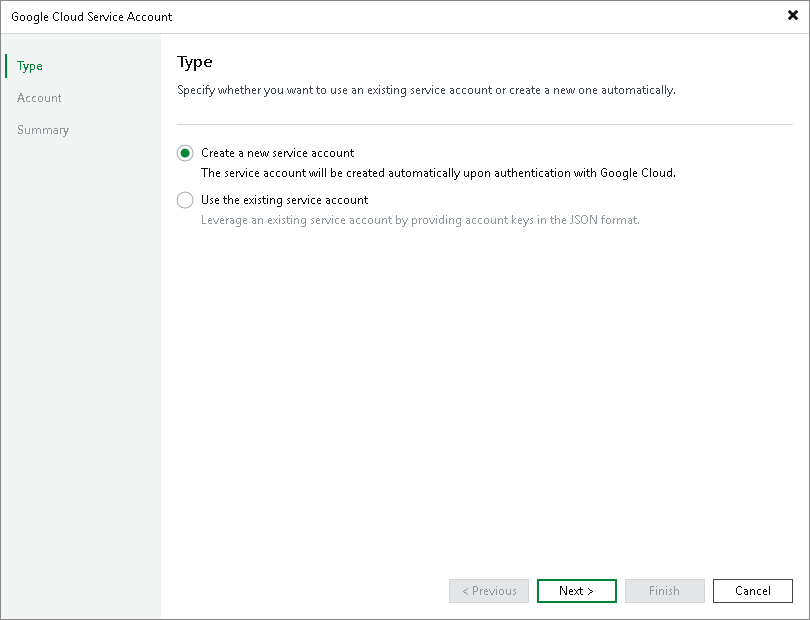
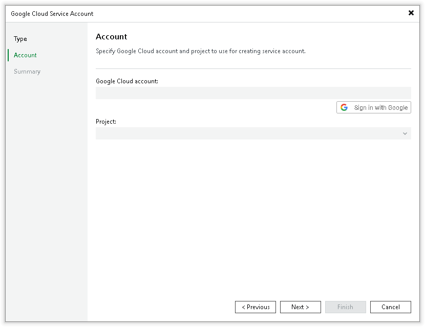
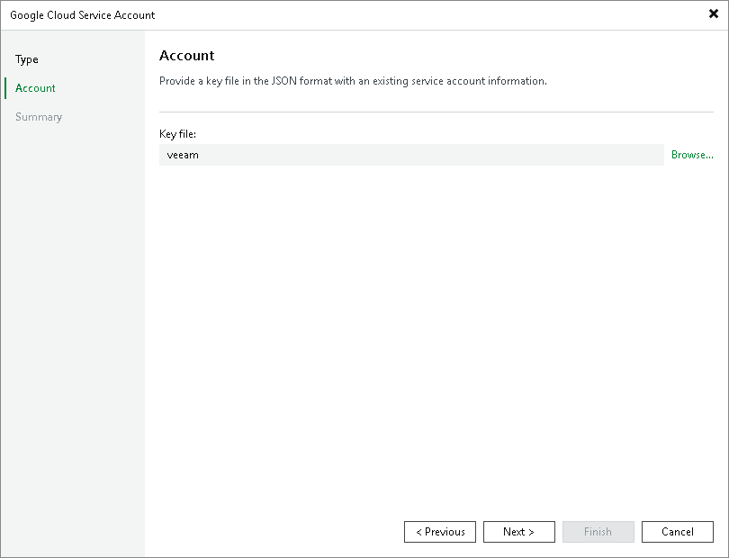

# Google Cloud Service Accounts

You can create a record for credentials that you plan to use to connect to Google Compute Engine within Google Cloud. This Google Cloud service account is used by Veeam Backup & Replication to perform direct restore to Google Compute Engine and backup and restore operations available with Veeam Plug-in for Google Cloud. For more information on the latter, see the [Veeam Backup for Google Cloud User Guide](https://helpcenter.veeam.com/docs/vbgc/guide/integration_vbr.html?ver=7).

To create a credentials record for a Google Cloud service account:

1. From the main menu, select Credentials and Passwords > Cloud Credentials.
2. Click Add > Google Cloud Platform service account.
3. At the Type step of the wizard, select if you want to create a new service account automatically or use an existing service account.

|  |
| --- |
| Note |
| If you select Create a new service account, the created service account will be granted the [Owner IAM role](https://cloud.google.com/iam/docs/understanding-roles?authuser=1#basic) with a wide scope of permissions and capabilities. If you want to limit the list of permissions granted to the service account, create a user-managed service account, as described in the [Google Cloud documentation](https://cloud.google.com/iam/docs/service-accounts#user-managed), with the limited set of permissions:   * For the information on permissions required to restore to Google Compute Engine, see [Google Compute Engine IAM User Permissions](gcp_iam_permissions.md). * For the information on permissions required to deploy Veeam Plug-in for Google Cloud, see the [Permissions](https://helpcenter.veeam.com/docs/vbgc/guide/plugin_permissions.html?ver=7) section in the Veeam Backup for Google Cloud User Guide. |

1. At the Account step of the wizard, specify credentials required for accessing the service account:

* If you have selected Create a new service account, do the following:

1. Log into your Google Cloud account. Read and accept the Google Terms of Service and the Google Privacy Policy.
2. Allow Veeam Backup & Replication to access your Google account. After that, Veeam Backup & Replication can manage your Identity and Access Management (IAM) policies, and see, edit, configure and delete your Google Cloud data.
3. Return to the wizard and select the project with which you want the created service account to work.

* If you have selected Use the existing service account, do the following:

1. Download the service account key in the JSON format, created as described in [Google Cloud documentation](https://cloud.google.com/iam/docs/creating-managing-service-account-keys).

|  |
| --- |
| Important |
| Depending on the scenarios that the service account will be used for, make sure that the service account meets all requirements and limitations.  For restoring virtual workloads from backups to Google Cloud, consider the requirements and limitations listed in section [Restore to Google Compute Engine](restore_google_byb.md). |

1. At the Account step of the wizard, select the downloaded service account key.

1. At the Summary step of the wizard, review details of the configured account and click Finish to close the wizard.

Related Topics

* [Editing and Deleting Credentials Records — Register New Service Account](cloud_credentials_edit_delete.md#register)
* [External Repositories](external_repository.md)
* [Restore to Google Compute Engine](restore_google.md)

